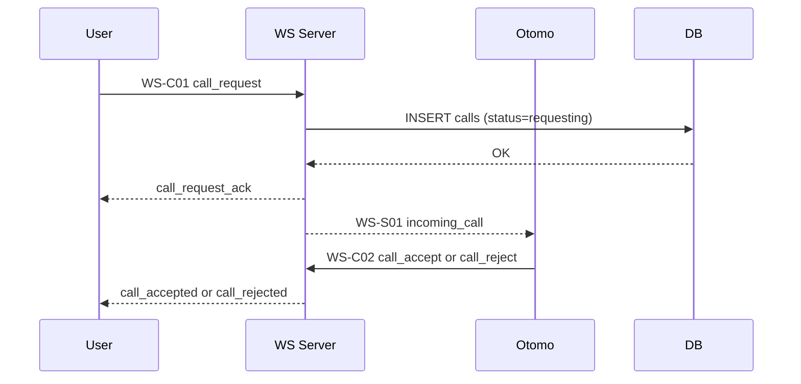

# WS-C01 発信イベント

このイベントは「ユーザーが通話を開始する瞬間」に使われる、WebRTC セッションの **最初の入り口であり最重要イベントのひとつ** です。

**ユーザー → サーバ → おともはん**

# 1. イベント概要

| 項目      | 内容                                                          |
| --------- | ------------------------------------------------------------- |
| ID        | WS-C01                                                        |
| type      | `call_request`                                                |
| direction | Client → Server（User → API Gateway）                         |
| 対象      | User（発信側）                                                |
| 目的      | おともはんへ「着信イベント WS-S01」を発生させるための発信要求 |

---

# 2. クライアント送信データ構造（User → Server）

```json
{
  "type": "call_request",
  "toUserId": "otomo-123",
  "callId": "d4e8f139-5212-4e2e-8c30-aaaabbbbcccc"
}
```

### フィールド仕様

| フィールド | 型     | 必須 | 説明                                  |
| ---------- | ------ | ---- | ------------------------------------- |
| type       | string | ○    | "call_request" 固定                   |
| toUserId   | string | ○    | 呼び出すおともはんのユーザー ID       |
| callId     | string | ○    | クライアント生成 or サーバ生成の UUID |

※ callId は **クライアント側生成でよい**（WebRTC はオーナー側が ID を作るのが自然）。

---

# 3. サーバ側の受信時バリデーション

### 1. JWT 認証必須

WS 接続時に token が無い場合 → 接続拒否。

### 2. toUserId が存在するか確認

DB クエリ：

```
SELECT * FROM users WHERE id = $1 AND role = 'otomo';
```

存在しなければ：

```json
{
  "type": "error",
  "error": "OTOMO_NOT_FOUND"
}
```

### 3. おともはんが現在 online か

```sql
SELECT status FROM otomo_status WHERE user_id = $1;
```

| status  | 挙動                                          |
| ------- | --------------------------------------------- |
| online  | 発信可能                                      |
| busy    | 呼び出し不可 → call_rejected をユーザーに返す |
| offline | 呼び出し不可                                  |

### 4. call の重複チェック

User が別の call に参加中なら reject。

---

# 4. サーバ内部処理フロー（重要）

WS-C01 の本質は「着信制御 + call レコード作成 + おともはんへ通知」です。

---

## STEP 1️⃣：call レコード作成（DB）

```sql
INSERT INTO calls (id, user_id, otomo_id, status, created_at)
VALUES ($callId, $senderUserId, $toUserId, 'requesting', NOW());
```

---

## STEP 2️⃣：おともはんへの着信通知（WS-S01）

送信形式：

```json
{
  "type": "incoming_call",
  "callId": "d4e8f1...",
  "fromUserId": "user-999",
  "fromUserName": "たろう",
  "fromUserAvatar": "/avatars/u1.jpg"
}
```

---

## STEP 3️⃣：発信側に "requesting" ステータス返す

```json
{
  "type": "call_request_ack",
  "callId": "d4e8f1...",
  "status": "requesting"
}
```

※ この ACK があると UI が安定する（U-03 遷移などに使う）。

---

# 5. サーバ → 発信側（User）へのレスポンス一覧

### ① call_request_ack（正常受付）

```json
{
  "type": "call_request_ack",
  "callId": "uuid",
  "status": "requesting"
}
```

---

### ② call_rejected（相手が busy / offline）

```json
{
  "type": "call_rejected",
  "reason": "busy"
}
```

---

### ③ error（不正リクエスト）

```json
{
  "type": "error",
  "error": "INVALID_CALL_REQUEST"
}
```

---

# 6. イベント時系列（User → Server → Otomo）



---

# 7. Fastify + ws（または uWebSocket.js）実装例（擬似コード）

```tsx
ws.on("message", async (raw) => {
  const msg = JSON.parse(raw);

  if (msg.type === "call_request") {
    const fromUserId = ws.user.userId;
    const toUserId = msg.toUserId;
    const callId = msg.callId;

    // otomo が online かチェック
    const otomo = await db.getOtomoStatus(toUserId);
    if (!otomo || otomo.status !== "online") {
      return ws.send(
        JSON.stringify({
          type: "call_rejected",
          reason: "busy",
        }),
      );
    }

    // callレコード作成
    await db.insertCall({
      id: callId,
      userId: fromUserId,
      otomoId: toUserId,
      status: "requesting",
    });

    // 発信側にACK
    ws.send(
      JSON.stringify({
        type: "call_request_ack",
        callId,
        status: "requesting",
      }),
    );

    // おともはんへ着信通知
    const otomoSocket = wsManager.getSocket(toUserId);
    if (otomoSocket) {
      otomoSocket.send(
        JSON.stringify({
          type: "incoming_call",
          callId,
          fromUserId,
          fromUserName: ws.user.name,
          fromUserAvatar: ws.user.avatarUrl,
        }),
      );
    }
  }
});
```

---

# 8. UI 連携ポイント（重要）

### 発信側の UI（U-03）では：

- call_request_ack 受信 → 「発信中」状態に遷移
- incoming_call は発信側には来ない
- call_accepted で U-04（通話画面）へ遷移
- call_rejected で「通話できません」アラート

### おともはん側（O-02）では：

- incoming_call 受信 → 着信画面に遷移
- call_accept / call_reject を返す

---

# 9. エラー一覧（WS-C01）

| error                | 原因                  |
| -------------------- | --------------------- |
| OTOMO_NOT_FOUND      | toUserId が存在しない |
| OTOMO_OFFLINE        | offline / break 中    |
| OTOMO_BUSY           | 別の通話中            |
| INVALID_CALL_REQUEST | パラメータ不正        |
| UNAUTHORIZED         | JWT 無効              |
| SERVER_ERROR         | 内部エラー            |

---

# 10. このイベントが担う役割

- WebRTC の始点となる最重要イベント
- 通話状態マシンの入口（requesting → ringing → accepted）
- おともはんを busy に設定するトリガ
- DB と WS の同期が重要
- 発信 UI の安定性に大きく影響する
