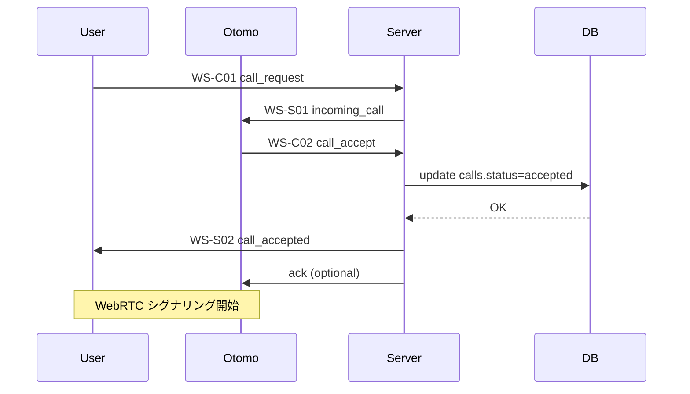

# WS-C02 call_accept（着信応答）

当イベントは **おともはんが着信に応答した瞬間に送られる重要イベント** で、
通話状態は `ringing → connecting` に進み、
続く WebRTC シグナリング開始（SDP 交換）へとつながります。

---

**おともはん → サーバ → 発信者（User）**

---

# 1. イベント概要

| 項目 | 内容 |
| --- | --- |
| ID | WS-C02 |
| type | `call_accept` |
| direction | Client（Otomo） → Server |
| 目的 | "応答" 操作をサーバに伝え、発信者へ call_accepted を通知する |
| トリガー | O-02（着信画面）で「応答する」を押したとき |

---

# 2. クライアント送信データ構造（Otomo → Server）

```json
{
  "type": "call_accept",
  "callId": "d4e8f139-5212-4e2e-8c30-aaaabbbbcccc"
}
```

### フィールド仕様

| フィールド | 型 | 必須 | 説明 |
| --- | --- | --- | --- |
| type | string | ○ | `"call_accept"` 固定 |
| callId | string | ○ | 対象の通話 ID |

---

# 3. サーバ側バリデーション

1. **JWT 認証必須**（接続ユーザーが otomo かも確認する）
2. callId のレコードが存在するか
3. call.status が `requesting` または `ringing` であるか
4. call.otomo_id がこの socket の userId と一致するか
5. すでに他のクライアントが accept 済みか確認

上記のどれかで NG → error イベント返却：

```json
{
  "type": "error",
  "error": "INVALID_CALL_ACCEPT"
}
```

---

# 4. サーバ内部処理フロー（重要）

### STEP 1️⃣：calls テーブル更新

```sql
UPDATE calls
SET status = 'accepted', accepted_at = NOW()
WHERE id = $callId;
```

### STEP 2️⃣：おともはんのステータスを busy に更新

```sql
UPDATE otomo_status
SET status = 'busy'
WHERE user_id = $otomoId;
```

※ 発信側にも busy 更新を broadcast（WS-S08）

---

### STEP 3️⃣：発信側に call_accepted イベント送信（WS-S02）

```json
{
  "type": "call_accepted",
  "callId": "d4e8f139-..."
}
```

---

### STEP 4️⃣：シグナリング開始準備

発信側・応答側ともに

**WebRTC の SDP（offer/answer）交換フェーズへ遷移**。

つまり U-03 → U-04、O-02 → O-03 へ遷移。

---

# 5. 発信者（User）側での動作

WS-S02（call_accepted）を受信すると：

- 状態：requesting/ringing → connecting
- WebRTC Offer/Answer の exchange を開始
- U-04 通話画面へ遷移

---

# 6. おともはん側での動作

call_accept を送ったら：

- O-02（着信画面） → O-03（通話準備画面）へ遷移
- WebRTC Answer の生成準備

---

# 7. イベント時系列図



---

# 8. Fastify / ws 実装例（擬似コード）

```tsx
ws.on("message", async (raw) => {
  const msg = JSON.parse(raw);

  if (msg.type === "call_accept") {
    const callId = msg.callId;
    const otomoId = ws.user.userId;

    const call = await db.getCall(callId);

    if (!call || call.otomo_id !== otomoId || call.status !== "requesting") {
      return ws.send(JSON.stringify({
        type: "error",
        error: "INVALID_CALL_ACCEPT"
      }));
    }

    await db.updateCallStatus(callId, "accepted");

    // Otomo を busy に
    await db.updateOtomoStatus(otomoId, "busy");

    // 発信者に通知
    const userSocket = wsManager.getSocket(call.user_id);
    if (userSocket) {
      userSocket.send(JSON.stringify({
        type: "call_accepted",
        callId
      }));
    }

    // 必要なら otomo にACK返す
    ws.send(JSON.stringify({
      type: "call_accept_ack",
      callId
    }));
  }
});
```

---

# 9. エラーパターンまとめ

| error | 状況 |
| --- | --- |
| INVALID_CALL_ACCEPT | callId 不正 / call 状態不正 |
| CALL_NOT_FOUND | DB に call 無し |
| PERMISSION_DENIED | 応答者が call.otomo_id と不一致 |
| CALL_ALREADY_ACCEPTED | race condition 回避 |
| UNAUTHORIZED | JWT 不正 |

---

# 10. このイベントが担う役割

- 着信状態（ringing）から通話準備（connecting）へ遷移させるコア処理
- call_accepted を発信側に伝えることで **双方向の WebRTC シグナリングが開始可能になる**
- おともはんステータスを busy にすることで一覧（U-01）更新にも影響

通話体験そのものを成立させる非常に重要なイベントです。