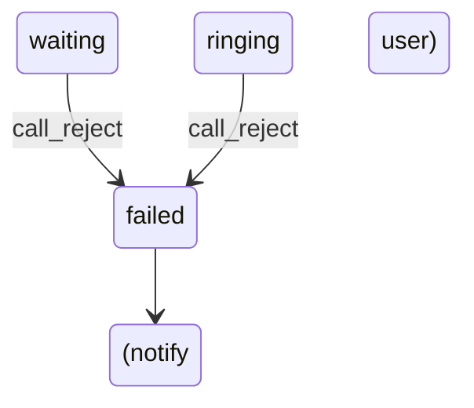
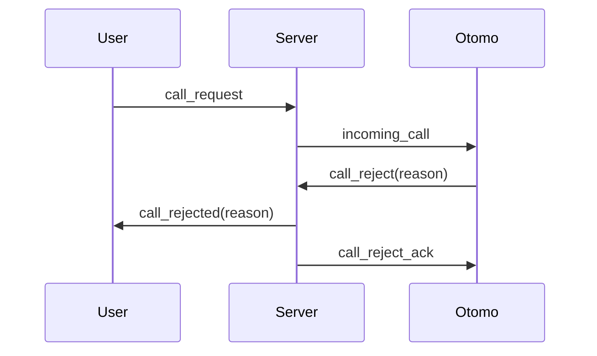

# WS-C03 call_reject（通話リクエスト拒否）

**call_reject** は、**着信を受け取った側（通常はおともはん / Otomo）がユーザーの通話リクエストを拒否する**ための重要な WebSocket イベント。

また、ユーザー側（User）にとっては「拒否された」ことを明確に伝える UI 更新が必要。

---

# 1. 目的（What & Why）

call_reject は以下の時に送信される：

- おともはん（Otomo）が着信画面（O-02）で **拒否ボタンを押した**
- おともはん側の理由で拒否（busy / away / system_error 等）
- タイムアウトによる自動拒否
- コール状態が有効でないためシステム側で reject

**役割：通話セッションを不成立のまま終了し、User へ即通知する。**

---

# 2. イベント送信者 / 受信者

| 役割 | 内容 |
| --- | --- |
| **送信者（通常）** | おともはんクライアント（Otomo端末） |
| **受信者（必須）** | ユーザー（User）クライアント |
| **受信者（必要時）** | おともはん自身（エコーバック）、サーバ内部ロジック |

---

# 3. イベント形式（Payload 仕様）

### ■ Otomo → Server（拒否ボタン押下時）

```json
{
  "type": "call_reject",
  "callId": "xxxx-xxxx",
  "reason": "busy"
}
```

### ■ サーバ → User（通知）

```json
{
  "type": "call_rejected",
  "callId": "xxxx-xxxx",
  "reason": "busy"
}
```

### ■ サーバ → Otomo（確認用、任意）

```json
{
  "type": "call_reject_ack",
  "callId": "xxxx-xxxx"
}
```

---

# 4. reason（拒否理由）一覧

| reason | 使用場面 | ユーザー表示 |
| --- | --- | --- |
| `"busy"` | おともはんが他通話中 | 現在通話中のため応答できません |
| `"manual_decline"` | おともはんが拒否ボタンを押した | 相手が通話を拒否しました |
| `"away"` | 不在 / 離席設定 | 現在対応できません |
| `"timeout"` | 30秒応答なし | 相手から応答がありませんでした |
| `"system_error"` | 内部エラー | 通話が成立しませんでした |

**理由はサーバが強制書き換えする場合もある（例：call 状態異常）。**

---

# 5. サーバ側での状態遷移（State Machine）

### call_reject は以下の状態でのみ受理：

| 現在の状態 | call_reject の扱い |
| --- | --- |
| `ringing` | 受理し、`failed` へ遷移 |
| `waiting` | 受理し、`failed` |
| `in_call` | 無効（reject ではなく end の領域） |
| `failed` | 無視 |
| `ended` | 無視 |

### 状態遷移図



---

# 6. サーバ側の処理フロー（重要）

1. call_reject 受信
2. callId とセッションの検証
    - 存在しない → エラー返却（後述）
3. call 状態が waiting / ringing か確認
4. call.status = "failed"
5. failedReason = reason
6. User へ `call_rejected` を送信
7. Otomo へ `call_reject_ack` を送信（任意）
8. ログを保存

---

# 7. User クライアント側の挙動（UI）

User は以下のどこにいてもイベントを受信可能：

- U-03：通話リクエスト確認モーダル
- U-02：おともはん詳細
- U-01：ホーム画面

### ■ 受信イベント例

```json
{
  "type": "call_rejected",
  "callId": "xxxx-xxxx",
  "reason": "manual_decline"
}
```

### ■ User UI 挙動（ケース別）

| User の画面 | 表示 | 遷移 |
| --- | --- | --- |
| **U-03（モーダル表示中）** | 「相手に拒否されました」 | モーダル閉じる |
| **U-02 おともはん詳細** | Toast：拒否されました | stay |
| **U-01 ホーム** | バナー通知 | stay |
| **接続待機中** | 「通話が拒否されました」 | stay or auto-close |

### 表示文言（例）

```
相手が通話を拒否しました。
```

timeout の場合：

```
相手から応答がありませんでした。
```

---

# 8. Otomo クライアント側の挙動

拒否ボタン押下時：

- call_reject 送信
- O-02（着信画面）を閉じる
- O-01（待機画面）へ戻る
- 任意で「拒否しました」Toast 表示

---

# 9. エラーケース（Otomo → Server）

送信した call_reject が失敗した場合：

### ■ パターン1：callId 不存在

Server → Otomo：

```json
{
  "type": "error",
  "code": "INVALID_CALL",
  "message": "通話リクエストが見つかりません"
}
```

UI：

```
通話リクエストが存在しないため拒否できませんでした。
```

---

### ■ パターン2：状態遷移が不正（例：in_call 中）

Server → Otomo：

```json
{
  "type": "error",
  "code": "INVALID_STATE",
  "message": "現在この操作はできません"
}
```

---

### ■ パターン3：認可エラー（call の参加者でない）

```json
{
  "type": "error",
  "code": "FORBIDDEN",
  "message": "この通話の操作権がありません"
}
```

---

# 10. イベント図（送信・受信）



---

# 11. 重要ポイントまとめ

- **call_reject は Otomo が通話リクエストを拒否するイベント**
- User には必ず **call_rejected** が届く
- 状態遷移は waiting/ringing → failed
- reason によって User UI の表示が変わる
- タイムアウト拒否も call_reject と同等扱い
- User がどの画面にいても確実に UI が更新される必要がある