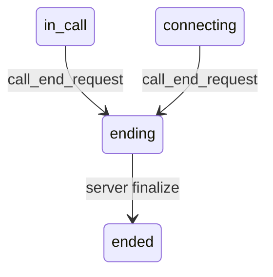
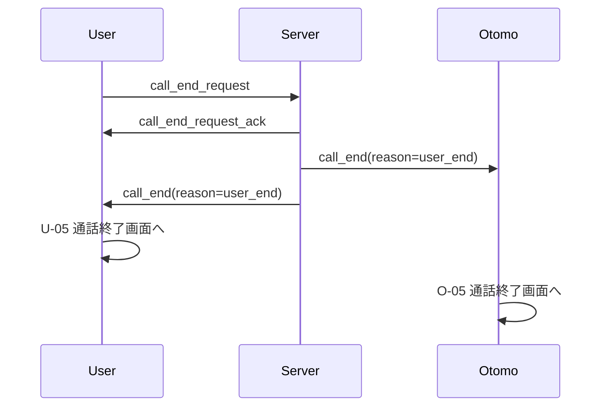

# WS-C04 call_end_request（通話終了リクエスト）

このイベントは、**通話中（U-04 / O-03）にユーザーまたはおともはんが「通話を終了したい」と要求する時に送信される**重要イベントです。

call_end_request はあくまで「終了要求」であり、

**通話の正式終了はサーバが authoritative に判断し、後続イベント call_end を全クライアントへ送る**というフローになります。

---

# 1. 目的（Why）

通話中、以下の操作によって発生するイベント：

- User が「通話終了」ボタンを押した
- Otomo が「通話終了」ボタンを押した

**→ 通話を終了してほしい、という意思をサーバに伝えるのが call_end_request**

正式な終了処理（課金締め・状態更新）はサーバのみが行う。

---

# 2. 送信者 / 受信者

| 種別 | 内容 |
| --- | --- |
| **送信者** | User または Otomo（通話の参加者どちらでも） |
| **受信者（直接）** | サーバ |
| **受信者（間接）** | もう一方の参加者（call_end イベントとして通知） |

---

# 3. イベント形式（Payload仕様）

### ■ クライアント → サーバ（終了要求）

```json
{
  "type": "call_end_request",
  "callId": "xxxx-xxxx"
}
```

※ reason は UI 都合で付けない（終了理由はサーバが決定する）

---

# 4. サーバ → クライアント（応答）

call_end_request の応答は **call_end_request_ack（任意）**

または **call_end（正式終了通知）** のいずれか。

### ① 任意の ACK（成功受付）

```json
{
  "type": "call_end_request_ack",
  "callId": "xxxx-xxxx"
}
```

### ② 終了処理後に送信される call_end（確定）

```json
{
  "type": "call_end",
  "callId": "xxxx-xxxx",
  "reason": "user_end",
  "totalSeconds": 182,
  "totalCharged": 300,
  "unitCount": 3,
  "balance": 720
}
```

---

# 5. call_end_request が成立する状態

サーバ側の状態が以下の場合のみ有効：

| call.status | call_end_request の扱い |
| --- | --- |
| `in_call` | 受理し ending 処理へ |
| `connecting` | 受理（接続前でも終了指示可能） |
| `ringing` | 基本は call_reject 領域だが、強制終了扱いで ending 遷移も許可が可能 |
| `ending` | 重複終了要求として無視 |
| `ended` | 無視 |

### 状態遷移図（簡易）



---

# 6. サーバ側の処理フロー

call_end_request を受信した際の処理は以下：

1. callId と参加者の認証チェック
    - 参加者でなければ `FORBIDDEN`
2. call の状態を確認（in_call or connecting）
3. 呼び出し元を記録
    - reason = `"user_end"` または `"otomo_end"`
    - 誰が終了を要求したかで理由が決まる
4. 課金を締める（最後の1分が跨がる場合の扱い）
5. call.status = ending
6. メディア停止（任意：signaling 経由で close）
7. call_end イベントを両者へ送信
8. 状態を ended として保存

---

# 7. クライアント UI の要求仕様（User & Otomo 共通）

### ■ “終了ボタン” を押した瞬間の UI

- 終了リクエスト送信開始（loading 表示）
- ローカルの WebRTC トラックを stop / mute（任意）
- 他方から call_end が来るまで “待機状態”

### ■ call_end_request_ack を受信した場合

- ローディング継続
    
    （ACK はあくまで「受付完了」にすぎない）
    

### ■ call_end を受信したら

→ U-05（通話終了画面）へ遷移

→ O-05（おともはん側の終了画面）へ遷移

---

# 8. エラーケース（重要）

call_end_request が失敗する場合：

### ■ パターン1：callId が存在しない

Server → Client:

```json
{
  "type": "error",
  "code": "INVALID_CALL",
  "message": "通話が見つかりません"
}
```

UI：

```
通話を終了できませんでした（通話が存在しません）
```

---

### ■ パターン2：権限エラー（参加者でない）

```json
{
  "type": "error",
  "code": "FORBIDDEN",
  "message": "この通話を終了する権限がありません"
}
```

---

### ■ パターン3：状態不正（すでに ended 等）

```json
{
  "type": "error",
  "code": "INVALID_STATE",
  "message": "通話はすでに終了しています"
}
```

---

# 9. 通話終了理由（サーバが決定）

call_end_request は理由を含まないため、

後続の call_end では以下の reason をサーバが自動付与する：

| 発生状況 | reason |
| --- | --- |
| User が end_request 送信 | `"user_end"` |
| Otomo が end_request 送信 | `"otomo_end"` |
| 残ポイント不足 | `"no_point"` |
| ネットワーク切断 | `"network_lost"` |
| システム内部エラー | `"system_error"` |
| タイムアウト（双方無反応等） | `"timeout"` |

---

# 10. シーケンス図（User 終了ボタン押下時）



---

# 11. 重要ポイント（まとめ）

- **call_end_request は「終了意思の送信」だけを担う**
- 終了処理は **サーバが authoritative**
- UI は call_end が届くまで「終了処理中」の状態
- reason は **サーバ側で決定**
- どちらが押しても同じイベント（call_end_request）