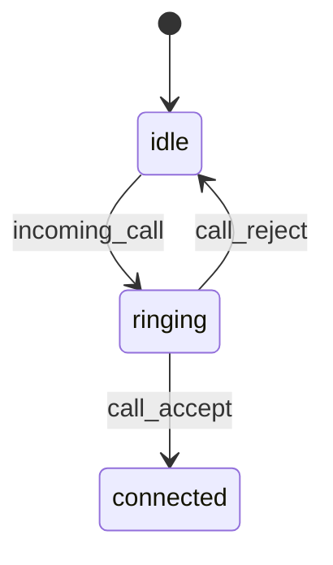

# WS-S01 着信通知

**おともはん側の最重要イベント**であり、通話全体の状態マシンにおいて`requesting → ringing` の遷移を担う中核イベント。

おともはん UI（O-02 着信画面）がこのイベントで動作する。

---

**サーバ → おともはん（Otomo）**

---

# 1. イベント概要

| 項目 | 内容 |
| --- | --- |
| ID | WS-S01 |
| type | `incoming_call` |
| direction | Server → Client（Otomo） |
| 役割 | おともはんに着信を知らせ、応答（accept/reject）を促す |
| トリガー | WS-C01（ユーザーの call_request）を受信したとき |

---

# 2. 送信される JSON データ仕様

サーバ → おともはん

```json
{
  "type": "incoming_call",
  "callId": "d4e8f139-5212-4e2e-8c30-aaaabbbbcccc",
  "fromUserId": "user-999",
  "fromUserName": "たろう",
  "fromUserAvatar": "/avatars/u1.jpg",
  "timestamp": 1706604120
}
```

---

# 3. 各フィールド詳細

| フィールド | 型 | 必須 | 説明 |
| --- | --- | --- | --- |
| type | string | ○ | `"incoming_call"` 固定 |
| callId | string | ○ | 通話を特定する UUID |
| fromUserId | string | ○ | 発信者（User）のID |
| fromUserName | string | ○ | 発信者の表示名 |
| fromUserAvatar | string/null | ○ | ユーザーのアイコンURL |
| timestamp | number | ○ | 着信が生成されたUNIX秒 |

---

# 4. サーバ側の送信タイミング

このイベントは以下の流れで送信されます：

1. User → WS-C01 call_request が送られる
2. サーバが DB に call を作成（status=requesting）
3. **おともはん側 WS 接続を特定**
4. **incoming_call を送信**

おともはん側がオンライン（websocket接続中）であることが前提。

---

# 5. おともはん側 UI（O-02）の動作と連携

受信後、クライアントは即座に O-02 画面へ遷移。

### O-02 の表示内容例

- 発信者アイコン
- 発信者名
- 通話リクエスト中
- [応答する] ボタン → WS-C02 call_accept
- [拒否する] ボタン → WS-C03 call_reject

---

# 6. イベント受信後の状態マシン遷移



incoming_call は **ringing 状態** を作るイベント。

---

# 7. Fastify / ws（または uWebSocket.js）送信例（擬似コード）

```tsx
const otomoSocket = wsManager.getSocket(toUserId);

if (otomoSocket) {
  otomoSocket.send(JSON.stringify({
    type: "incoming_call",
    callId,
    fromUserId: user.id,
    fromUserName: user.name,
    fromUserAvatar: user.avatarUrl,
    timestamp: Date.now() / 1000
  }));
}
```

---

# 8. エラーパターン（サーバ内部判断）

もしおともはんが offline の場合 → 発信側には WS-S03 call_rejected（reason=offline）を送る。

おともはん側には何も送信しない。

---

# 9. 発信者（User）との関係

User はこのイベントを受け取らない（おともはん専用）。

User が受け取るのは：

- call_request_ack（ACK）
- call_accepted（WS-S02）
- call_rejected（WS-S03）

---

# 10. このイベントが担う役割（まとめ）

incoming_call は、通話体験の「入口」を形成するイベントであり：

- おともはん側に着信画面を表示
- 呼び出し UI と WebRTC への橋渡し
- 通話状態マシンの変化を発火
- 発信者情報を瞬時に共有

という複数の役割を担っている。通話サービスの UX を決定する非常に重要な要素。