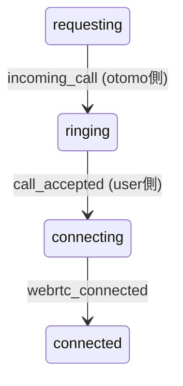
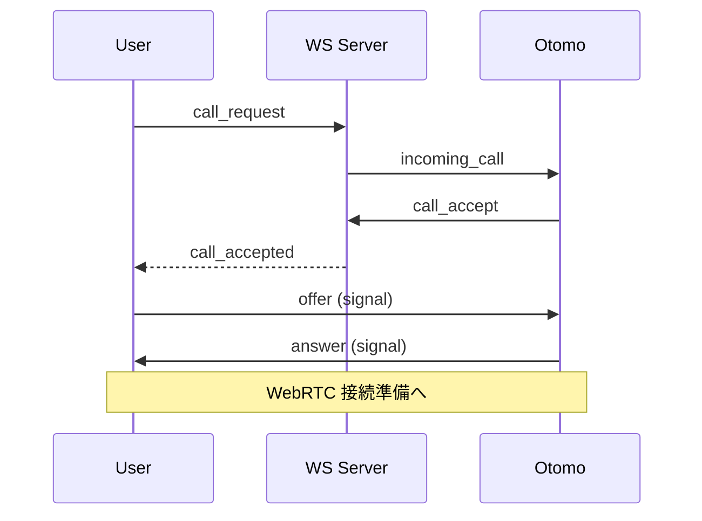

# WS-S02 call_accepted(発信者へ通知)

これは **発信者（User）側が通話接続に進むために必須のイベント** で、通話状態マシンでは **requesting → connecting** の遷移を担います。WebRTC シグナリング（offer/answer）がこの通知を合図に始まるため、リアルタイム通話の成否に直結する非常に重要なイベントです。

---

# 1. イベント概要

| 項目 | 内容 |
| --- | --- |
| ID | WS-S02 |
| type | `call_accepted` |
| direction | Server → 発信者（User） |
| 発火タイミング | おともはんが WS-C02 を送信したとき |
| 目的 | 発信者側を **通話接続準備状態（connecting）** に遷移させ、
WebRTC シグナリングを開始させる |

---

# 2. 発信者（User）へ送信される JSON

```json
{
  "type": "call_accepted",
  "callId": "d4e8f139-5212-4e2e-8c30-aaaabbbbcccc",
  "timestamp": 1706604300
}
```

### フィールド仕様

| フィールド | 型 | 必須 | 説明 |
| --- | --- | --- | --- |
| type | string | ○ | `"call_accepted"` 固定 |
| callId | string | ○ | 通話ID |
| timestamp | number | ○ | 応答が成立した時間（UNIX秒） |

---

# 3. 発信者側（User）の UI での動作

このイベントを受信したら：

### 1. 状態遷移

```
requesting → connecting（もしくは preparing）
```

### 2. WebRTC Offer/Answer の開始

- 発信者側が **offer SDP を生成して送信**
- WS-C05（signal）を通して相手へ SDP を送る

### 3. U-03 → U-04 の遷移

発信者画面は「待機画面」から「通話準備（P2P接続フェーズ）」へ移行。

---

# 4. サーバ側の挙動

このイベントは以下の流れで送信されます：

1. おともはんが WS-C02 call_accept を送信
2. サーバは call.status を `accepted` に更新
3. 発信者の WebSocket を取得
4. **call_accepted を送信**

---

# 5. サーバ実装例（擬似コード）

```tsx
// call_accept を受信したフロー内で実行
const userSocket = wsManager.getSocket(call.user_id);

if (userSocket) {
  userSocket.send(JSON.stringify({
    type: "call_accepted",
    callId,
    timestamp: Date.now() / 1000
  }));
}
```

送信後、両者は WebRTC phase に入る。

---

# 6. 状態マシンとの対応



発信者側は `call_accepted` で connecting に遷移する。

---

# 7. エラーは発生しない設計

WS-S02 は「成功通知」のため、

発信者側で error が返されることはありません。

ただし受信後に SDP の交換に失敗すると以下のケースが起きます：

| 状況 | 影響 |
| --- | --- |
| WebRTC negotiation 失敗 | call_end(reason="network_lost") |
| 相手のICE candidate受信不可 | 通話開始不能 |
| タイムアウト | call_end(reason="timeout") |

これらは WS-S02 の責務外。

---

# 8. 発信者・おともはん間の時系列シーケンス図



---

# 9. このイベントの重要性（まとめ）

`call_accepted` は通話前の **最も重要な分岐点** である。

- 通話を開始できるかどうか
- 状態マシンが正しく遷移するか
- WebRTC シグナリングのスタートトリガ
- UI（U-03 → U-04）の遷移トリガ

ユーザ体験における「快適な接続成功率」を左右する。