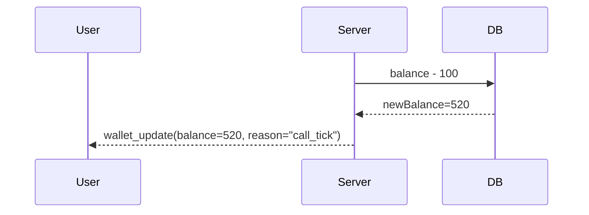
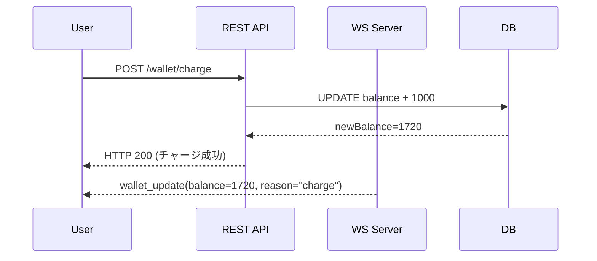

# WS-S06 wallet_update(残高リアルタイム更新)

了解しました。

ここでは **WS-S06「wallet_update」（残高のリアルタイム更新）」** の詳細設計を作成します。

このイベントは、通話中のポイント消費（call_tick）やチャージ成功時（wallet/charge）など、

ユーザーの残高が変わるすべてのタイミングで **即時 UI を更新するための重要イベント** です。

---

# 1. イベント概要

| 項目         | 内容                                                              |
| ------------ | ----------------------------------------------------------------- |
| ID           | **WS-S06**                                                        |
| type         | `wallet_update`                                                   |
| direction    | **Server → User（本人のみ）**                                     |
| 用途         | 残高が変更された瞬間にユーザーに通知し、UI と状態を即時同期させる |
| 主なトリガー | ・call_tick 成功時                                                |

・wallet/charge チャージ成功時
・運営側付与/調整（任意） |

---

# 2. 送信される JSON 形式

```json
{
  "type": "wallet_update",
  "balance": 520,
  "reason": "call_tick",
  "timestamp": 1706604800
}
```

---

# 3. フィールド仕様

| フィールド | 型     | 必須 | 内容                             |
| ---------- | ------ | ---- | -------------------------------- |
| type       | string | ○    | `"wallet_update"` 固定           |
| balance    | number | ○    | 更新後のポイント残高             |
| reason     | string | ○    | 残高が変わった理由（下記に定義） |
| timestamp  | number | ○    | UNIX 秒                          |

---

## reason の種類（標準化）

| reason       | 説明                   |
| ------------ | ---------------------- |
| `call_tick`  | 1 分課金で残高が減った |
| `charge`     | チャージで残高が増えた |
| `adjustment` | 運営による調整（任意） |

---

# 4. どのタイミングで通知されるか（重要）

### 1. **call_tick**（WS-S05 の後）

サーバは課金後：

```
users.balance = newBalance
```

を更新し、直後に：

```
wallet_update(balance=新残高, reason=call_tick)
```

を送る。

### 2. **チャージ成功後（wallet/charge）**

- DB で balance を加算
- クライアントに HTTP レスポンス
- 同時に **wallet_update(reason="charge")** を送信

→ フロントが最新残高に確実に同期される。

### 3. **手動付与や返金（任意）**

運営ツールから balance を操作した場合にも送信。

---

# 5. クライアント UI の動作（User 側）

このイベントは以下の画面に影響：

- U-06（ウォレット残高）
- U-04（通話中画面の残りポイント）
- ヘッダーなど共通 UI のポイント表示

### UI ルール

1. `balance` をただちにグローバルステートへ更新
2. `reason=="call_tick"` の場合

   → カウントダウンや残り時間の警告 UI を更新

3. `reason=="charge"` の場合

   → 「チャージが反映されました」など toast 表示も可能

---

# 6. サーバ側実装（擬似コード）

```tsx
function sendWalletUpdate(userId: string, newBalance: number, reason: string) {
  const ws = wsManager.getSocket(userId);
  if (!ws) return;

  ws.send(
    JSON.stringify({
      type: "wallet_update",
      balance: newBalance,
      reason,
      timestamp: Math.floor(Date.now() / 1000),
    }),
  );
}
```

---

### call_tick による発火

```tsx
const newBalance = await db.updateUserBalance(userId, -charge);
sendWalletUpdate(userId, newBalance, "call_tick");
```

---

### チャージにより発火

```tsx
const newBalance = await db.updateUserBalance(userId, +chargedAmount);
sendWalletUpdate(userId, newBalance, "charge");
```

---

# 7. 状態マシンとの関係

wallet_update は **状態マシンの状態そのものは変えないが**

通話続行可能かどうかを判断する重要な補助イベント。

例：

```
connected（通話中）
↓ call_tick
wallet_update(balance: 0)
↓
サーバ側で no_point → call_end
```

---

# 8. イベントシーケンス例 ①：通話中の tick



---

# 9. イベントシーケンス例 ②：チャージ完了



---

# 10. エラー通知は無い

wallet_update は成功時のみ送信されるイベント。

エラー（決済失敗など）は REST /wallet/charge の HTTP レスポンスで通知するため、
WS 側で error を返す必要はない。

---

# 11. このイベントの役割（重要ポイント）

wallet_update はサービス全体の UX と状態整合性を保つための基盤イベント。

- **リアルタイム残高同期**
- **課金処理の反映**
- **チャージや残高不足検知に利用**
- **複数端末での整合性保持**（マルチログイン時の同時更新にも使える）

とくに通話中は call_tick とセットで UI の正確性を保つため必須。
