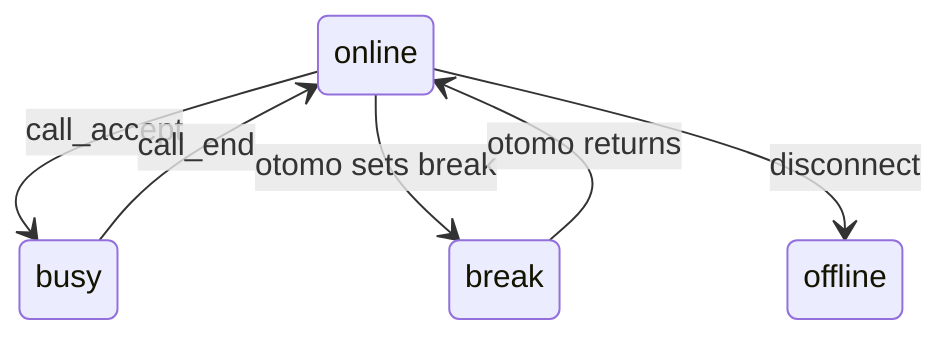
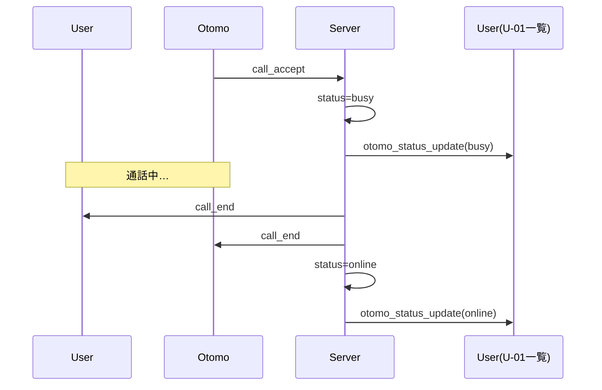

# WS-S08 otomo_status_update（おともはんステータス更新）

当イベントは、おともはん一覧の“オンライン / 応対中（busy） / オフライン”の更新を

遅延なく同期させるための仕組みで、**U-01（ホーム／おともはん一覧）のリアルタイム性**を担う。

---

# 1. イベント概要

| 項目 | 内容 |
| --- | --- |
| ID | **WS-S08** |
| type | `otomo_status_update`  |
| direction | **Server → 全ユーザー（User & Otomo）** |
| 役割 | おともはんのステータス変化をリアルタイムに一覧へ反映する |
| 発火タイミング | ・おともはんのログイン / ログアウト
・待機（online）/ 離席（break）更新
・通話開始時 busy へ
・通話終了後 online へ |

---

# 2. イベント JSON 仕様

```json
{
  "type": "otomo_status_update",
  "userId": "otomo-123",
  "status": "busy",
  "timestamp": 1706605100
}
```

---

# 3. フィールド仕様

| フィールド | 型 | 必須 | 内容 |
| --- | --- | --- | --- |
| type | string | ○ | `"otomo_status_update"` 固定 |
| userId | string | ○ | 対象おともはんの userId |
| status | string | ○ | `"online" |
| timestamp | number | ○ | 状態変更の発生時刻（UNIX秒） |

---

# 4. ステータスの種類（正規化）

| 状態 | 説明 |
| --- | --- |
| `online` | 待機中で通話可能 |
| `busy` | 通話中 |
| `offline` | 非ログイン or 強制終了 |
| `break` | 一時離席（任意機能） |

---

# 5. イベントが発火するタイミング（重要）

---

## ① おともはんがログイン（WebSocket 接続）

→ `online`

---

## ② O-01（待機画面）でステータス変更

- 「オンラインにする」
- 「離席モードにする」

→ `online` / `break`

---

## ③ 通話開始（call_accept）

おともはんが応答した瞬間

```
status = busy
```

→ WS-S08 を全クライアントへ broadcast

---

## ④ 通話終了（call_end）

通話が終わり通話終了イベント（WS-S07）後：

```
status = online
```

→ WS-S08 broadcast

---

## ⑤ WebSocket 切断（意図せぬ離脱）

ping/pong 途絶など

```
status = offline
```

→ broadcast

---

# 6. U-01（おともはん一覧）での UI 動作

---

## 受信後：

```
otomo[userId].status = status
```

### 表示更新例：

| status | 表示例 |
| --- | --- |
| online | 緑のインジケータ |
| busy | 赤の「通話中」バッジ |
| break | 黄色の「離席中」バッジ |
| offline | グレー表示・非アクティブ |

---

## ソートも変更

- `online` を最上段に
- `busy` は下に回す
- `offline` は最後尾へ

リアルタイムな一覧表示更新が実現する。

---

# 7. サーバ内部の送信ロジック

```tsx
function broadcastOtomoStatus(userId: string, status: string) {
  const message = JSON.stringify({
    type: "otomo_status_update",
    userId,
    status,
    timestamp: Math.floor(Date.now() / 1000)
  });

  wsManager.broadcastToAll(message);
}
```

---

# 8. 実際に発火するサーバ処理例

---

### call_accept 直後（通話開始）

```tsx
await db.updateOtomoStatus(otomoId, "busy");
broadcastOtomoStatus(otomoId, "busy");
```

---

### call_end 後（通話終了）

```tsx
await db.updateOtomoStatus(otomoId, "online");
broadcastOtomoStatus(otomoId, "online");
```

---

### O-01 で手動変更

```tsx
await db.updateOtomoStatus(userId, "break");
broadcastOtomoStatus(userId, "break");
```

---

### WebSocket 切断時

```tsx
await db.updateOtomoStatus(userId, "offline");
broadcastOtomoStatus(userId, "offline");
```

---

# 9. 状態マシンとの連携



WS-S08 は **状態変化の通知そのもの**。

---

# 10. イベントシーケンス例（通話開始 → 終了）



---

# 11. エラーハンドリング

WS-S08 は **サーバが確定情報だけ送るイベント** のため

通常クライアント側に error を返すことはない。

ただし以下はログに残す：

- 該当 otomo が DB に存在しない
- broadcast が socket error

UI への通知は不要。

---

# 12. このイベントの重要性（まとめ）

otomo_status_update は **一覧画面 U-01 のリアルタイム性そのもの** を司るイベント。

役割：

- 人気のあるおともはんが busy かどうか即座に判断可能
- 通話開始／終了に応じて一覧を動的に更新
- おともはん側の待機状況を正確に反映
- マッチング体験を向上させる UX の要素

リアルタイムサービスとして成立するための必須イベントです。