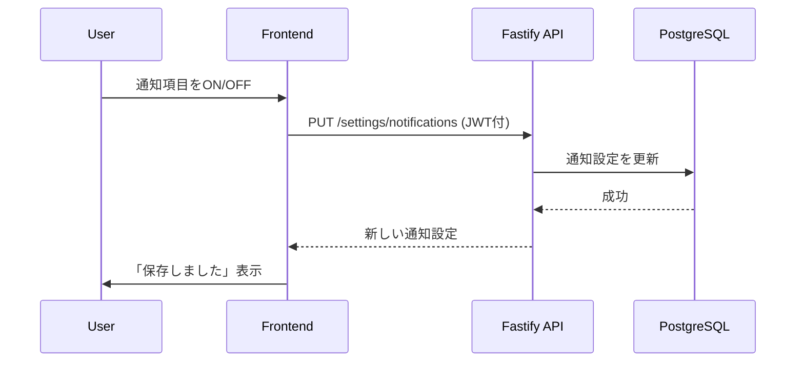

# SET-02 通知設定変更

**PUT /settings/notifications**

---

当API はユーザーが通知の ON/OFF を好みに合わせて制御できるようにするもので、アプリ体験や通話受信の利便性に関わる重要な設定である。

通知とは、以下のようなものを想定：

- 着信通知（おともはん待機 → User へ）
- 通話履歴やポイント残高の情報通知
- お知らせ（任意）

---

# 1. API 概要

| 項目 | 内容 |
| --- | --- |
| API ID | SET-02 |
| メソッド | PUT |
| エンドポイント | `/settings/notifications` |
| 認証 | 必須（JWT） |
| 主な目的 | ユーザーの通知設定を更新する |
| 対象画面 | C-04 設定画面 |

---

# 2. 設定可能な通知項目

MVP では下記を想定：

| 項目名 | 説明 | デフォルト |
| --- | --- | --- |
| incomingCall | おともはんからの着信通知 | true |
| callSummary | 通話終了後のサマリー通知（任意） | true |
| walletAlert | 残ポイントが一定以下の通知 | true |
| marketing | 運営からのお知らせ（任意） | false |

※ 必要に応じて追加可能。

---

# 3. Request Body 仕様

```json
{
  "incomingCall": true,
  "callSummary": false,
  "walletAlert": true,
  "marketing": false
}
```

### 各フィールドの仕様

| フィールド | 型 | 必須 | 備考 |
| --- | --- | --- | --- |
| incomingCall | boolean | 任意 | 未設定なら変更なし |
| callSummary | boolean | 任意 | 同上 |
| walletAlert | boolean | 任意 | 同上 |
| marketing | boolean | 任意 | 同上 |

※ PATCH 方式に近い挙動（渡した値だけ更新）。

---

# 4. Response Body（成功時）

```json
{
  "status": "success",
  "settings": {
    "incomingCall": true,
    "callSummary": false,
    "walletAlert": true,
    "marketing": false
  }
}
```

---

# 5. エラーレスポンス一覧

| 状況 | ステータス | error | message |
| --- | --- | --- | --- |
| JWT無効 | 401 | UNAUTHORIZED | 認証が必要です |
| 各値が boolean でない | 400 | INVALID_VALUE | 不正な値が含まれています |
| DB更新失敗 | 500 | DB_ERROR | 設定を更新できませんでした |

---

# 6. DB テーブル設計（notifications_settings）

推奨：`user_settings` テーブル内の JSONB として保持

（柔軟に項目追加できるため）

---

## テーブル例：user_settings

| カラム名 | 型 | NOT NULL | 説明 |
| --- | --- | --- | --- |
| user_id | uuid | PK / FK | users.id |
| notifications | jsonb | ✓ | 通知設定 |

### JSONB の例：

```json
{
  "incomingCall": true,
  "callSummary": true,
  "walletAlert": true,
  "marketing": false
}
```

### 更新 SQL 例：

```sql
UPDATE user_settings
SET notifications = notifications || $1::jsonb
WHERE user_id = $2;
```

---

# 7. Fastify + TypeScript 擬似実装

```tsx
app.put('/settings/notifications', async (req, reply) => {
  const userId = req.user.userId; // JWTから取得
  const settings = req.body;

  // Validate
  for (const key of Object.keys(settings)) {
    if (typeof settings[key] !== "boolean") {
      return reply.code(400).send({
        error: "INVALID_VALUE",
        message: `${key} には boolean を指定してください`
      });
    }
  }

  // Update DB
  await db.query(
    `UPDATE user_settings
     SET notifications = notifications || $1::jsonb
     WHERE user_id = $2`,
    [settings, userId]
  );

  // Return new settings
  const updated = await db.query(
    `SELECT notifications FROM user_settings WHERE user_id = $1`,
    [userId]
  );

  return reply.send({
    status: "success",
    settings: updated.rows[0].notifications
  });
});
```

---

# 8. API シーケンス図（C-04 設定画面 → API）



---

# 9. この API の役割

- プライバシー・通知体験をコントロールする基幹部分
- 着信通知の許可/拒否は通話体験に直結
- JSONB 方式により設定項目を追加しやすい
- C-04 設定画面と密接に連動

MVP では最低限の設定でもよいが、将来の拡張を考慮して柔軟な設計としている。