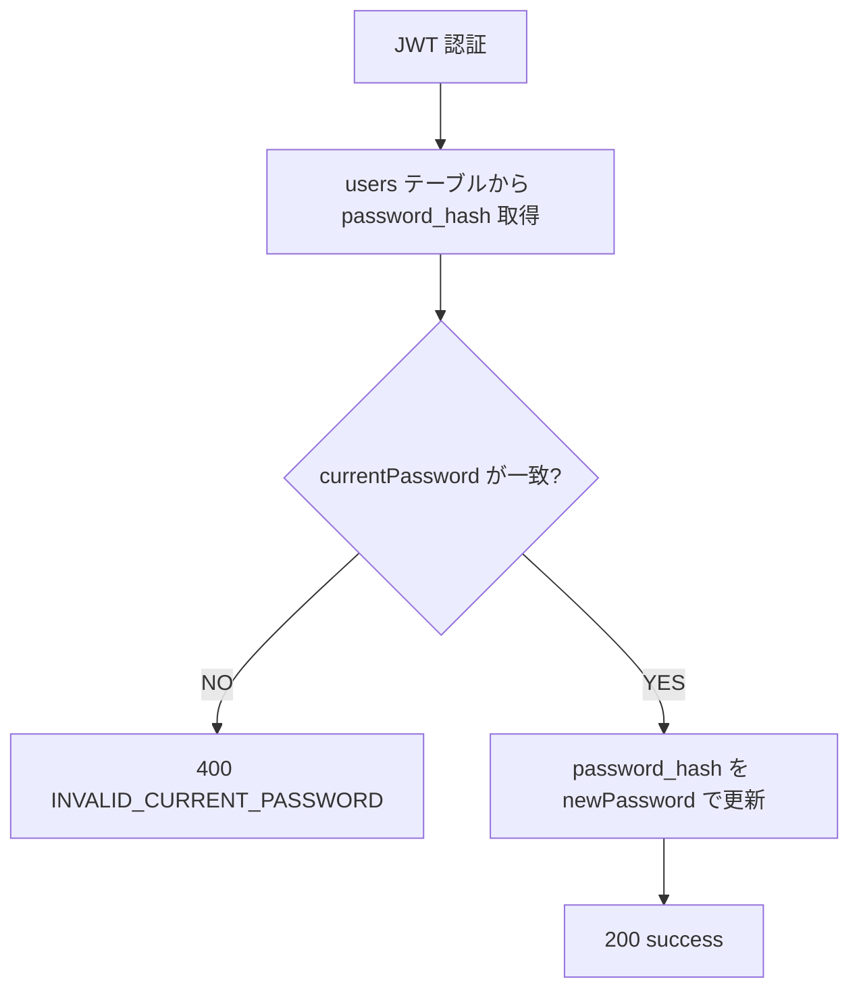

# USER-04 パスワード変更（PUT /user/password）

この API は「任意（オプション）」とされていますが、メールログイン方式を採用する場合は実装しておくとユーザーの安心感につながります。

また、セキュリティ観点からも重要です。

---

# 1. API 概要

| 項目 | 内容 |
| --- | --- |
| API ID | **USER-04** |
| メソッド | PUT |
| エンドポイント | `/user/password` |
| 認証 | 必須（JWT） |
| 目的 | 現在のパスワードを確認し、新しいパスワードへ更新する |
| 備考 | SNSログイン（Google等）の場合は非対応でよい |

---

# 2. リクエスト仕様（Body）

```json
{
  "currentPassword": "oldPass123!",
  "newPassword": "newPass456!!"
}
```

---

# 3. フィールド仕様

| フィールド | 型 | 必須 | 説明 |
| --- | --- | --- | --- |
| currentPassword | string | ○ | 現在のパスワード |
| newPassword | string | ○ | 新しく設定するパスワード |

---

# 4. パスワード要件（推奨）

| 要件 | 説明 |
| --- | --- |
| 8〜72文字 | bcrypt の安全上限を考慮 |
| 英大文字・小文字・数字・記号の混在推奨 | 強度を上げる |
| 全角禁止 | 入力事故防止 |

例：

**newPassword は以下の形式を推奨**

```
- 8文字以上
- 半角英字・数字・記号のいずれかを含む
```

---

# 5. バリデーションエラー（例）

### パスワード要件を満たさない場合

```json
{
  "status": "error",
  "error": "INVALID_PASSWORD_FORMAT",
  "message": "Password must be at least 8 characters."
}
```

---

# 6. サーバ側の処理フロー



---

# 7. DB 更新クエリ

```sql
UPDATE users
SET password_hash = $hashed,
    updated_at = NOW()
WHERE id = $userId;
```

bcrypt（もしくは argon2）でハッシュ化する。

---

# 8. 成功レスポンス

```json
{
  "status": "success"
}
```

→ 追加で message を返す形式でも良いが簡潔で OK。

---

# 9. エラーレスポンス

### 現在のパスワードが一致しない

```json
{
  "status": "error",
  "error": "INVALID_CURRENT_PASSWORD",
  "message": "Current password is incorrect."
}
```

### newPassword が要件を満たさない

```json
{
  "status": "error",
  "error": "INVALID_PASSWORD_FORMAT"
}
```

### DB エラー

```json
{
  "status": "error",
  "error": "DB_ERROR"
}
```

---

# 10. Fastify + TypeScript 擬似実装

```tsx
import bcrypt from "bcrypt";

app.put('/user/password', async (req, reply) => {
  const { userId, role } = req.user;

  if (role !== "user") {
    return reply.code(403).send({
      status: "error",
      error: "FORBIDDEN"
    });
  }

  const { currentPassword, newPassword } = req.body;

  // Validate new password
  if (!newPassword || newPassword.length < 8) {
    return reply.code(400).send({
      status: "error",
      error: "INVALID_PASSWORD_FORMAT"
    });
  }

  const row = await db.query(
    `SELECT password_hash FROM users WHERE id = $1`,
    [userId]
  );

  const valid = await bcrypt.compare(currentPassword, row.rows[0].password_hash);
  if (!valid) {
    return reply.code(400).send({
      status: "error",
      error: "INVALID_CURRENT_PASSWORD"
    });
  }

  const hashed = await bcrypt.hash(newPassword, 10);

  await db.query(
    `UPDATE users SET password_hash = $1, updated_at = NOW() WHERE id = $2`,
    [hashed, userId]
  );

  return reply.send({ status: "success" });
});
```

---

# 11. フロントエンド側の動作

1. U-11（プロフィール編集）から「パスワード変更」画面へ遷移
2. currentPassword・newPassword を送信
3. 成功 → toast 表示（例：「パスワードを変更しました」）
4. エラーは表示して再入力を促す

ログアウトは不要（JWT はそのまま利用可能）。

---

# 12. この API の役割（まとめ）

USER-04 はシンプルですが、安全なサービス運用に不可欠な機能です。

- ユーザー自身でパスワードを更新できる
- 不正アクセス対策として重要
- bcrypt/argon2 を利用して安全なパスワード管理
- /user/me /auth/me と組み合わせると UX が向上