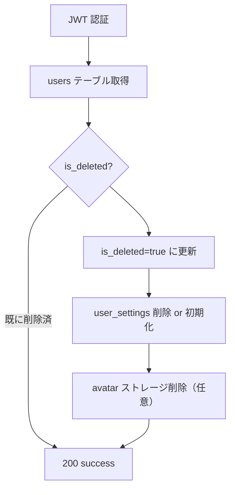

# USER-05 アカウント削除（DELETE /user/delete）

この API は任意機能ですが、ユーザーの自己管理権を満たすために非常に重要であり、**個人情報保護（GDPR / 日本の個人情報保護法）にも対応した設計**をする必要があります。

アカウント削除は「論理削除か物理削除か」の選択も重要なため、ここでは **論理削除（soft delete）方式** を採用します。

---

# 1. API 概要

| 項目 | 内容 |
| --- | --- |
| API ID | **USER-05** |
| メソッド | DELETE |
| エンドポイント | `/user/delete` |
| 認証 | 必須（JWT） |
| 目的 | ユーザー自身のアカウントを削除（論理削除） |
| 影響範囲 | プロフィール・通話履歴・ポイント情報などに影響 |

---

# 2. 削除方式の方針

ここでは安全性・法令対応・内部データ保全の観点から**論理削除（soft delete）** を採用します。

### 論理削除のメリット

✓ 通話履歴・課金履歴の整合性が保てる

✓ ユーザーの復元が可能（運用上便利）

✓ 法的に必要なログ保持がしやすい

✓ データの整合性が壊れない

### 実装方法

users テーブルに `is_deleted` フラグを設ける：

| カラム | 型 | 説明 |
| --- | --- | --- |
| is_deleted | boolean | デフォルト false |

削除時は true に切り替える。

プロフィール画像・通知設定などは削除しても良いが、通話履歴・課金履歴は残す。

---

# 3. リクエスト仕様（Body は不要）

```
DELETE /user/delete
Authorization: Bearer <JWT>
```

---

# 4. 成功レスポンス

```json
{
  "status": "success"
}
```

---

# 5. サーバ側処理フロー



---

# 6. 削除時に実施する処理（推奨）

### ① users テーブル

```sql
UPDATE users
SET is_deleted = true,
    name = '退会ユーザー',
    avatar_url = NULL,
    bio = NULL,
    updated_at = NOW()
WHERE id = $userId;
```

匿名化のため、名前やプロフィールは消す。

---

### ② user_settings テーブル

```sql
DELETE FROM user_settings WHERE user_id = $userId;
```

通知設定は不要になるため削除。

---

### ③ avatar ストレージ削除（任意）

ユーザーの画像フォルダを削除

（個人情報保護対応）

---

### ④ refresh_tokens 削除（重要）

```sql
DELETE FROM refresh_tokens WHERE user_id = $userId;
```

再ログインされないようにする。

---

### ⑤ WebSocket 切断

フロント側で行う。

---

# 7. エラーレスポンス

### 権限不足（Otomo が呼んだ場合）

```json
{
  "status": "error",
  "error": "FORBIDDEN",
  "message": "This endpoint is for user role only."
}
```

### DB エラー

```json
{
  "status": "error",
  "error": "DB_ERROR"
}
```

---

# 8. Fastify + TypeScript 擬似実装

```tsx
app.delete('/user/delete', async (req, reply) => {
  const { userId, role } = req.user;

  if (role !== "user") {
    return reply.code(403).send({
      status: "error",
      error: "FORBIDDEN"
    });
  }

  // 論理削除
  await db.query(
    `UPDATE users
     SET is_deleted = true,
         name = '退会ユーザー',
         avatar_url = NULL,
         bio = NULL,
         updated_at = NOW()
     WHERE id = $1`,
    [userId]
  );

  // 設定削除
  await db.query(
    `DELETE FROM user_settings WHERE user_id = $1`,
    [userId]
  );

  // refresh tokens 削除
  await db.query(
    `DELETE FROM refresh_tokens WHERE user_id = $1`,
    [userId]
  );

  return reply.send({ status: "success" });
});
```

---

# 9. クライアント側の動作フロー

1. 「退会しますか？」ダイアログ
2. DELETE /user/delete を実行
3. 成功 → ローカルの token を削除
4. WebSocket を close
5. /login に強制遷移
6. 以降はログイン不可

---

# 10. 注意点（法務・運用）

- 通話履歴（billing history）は削除しない → 会計上必要
- ユーザーから個人情報を削除して匿名化する
- プロフィール画像は削除する
- DB バックアップには残る（問題なし）
- 「復元機能」を実装するかは運用判断

---

# まとめ

USER-05 DELETE /user/delete はシンプルに見えますが、

- 論理削除か物理削除かの選択
- 個人情報保護の観点
- 匿名化処理
- 通話履歴の整合性維持
- トークン破棄
- ストレージ削除

など、サービスの信頼性に直結する重要な API です。