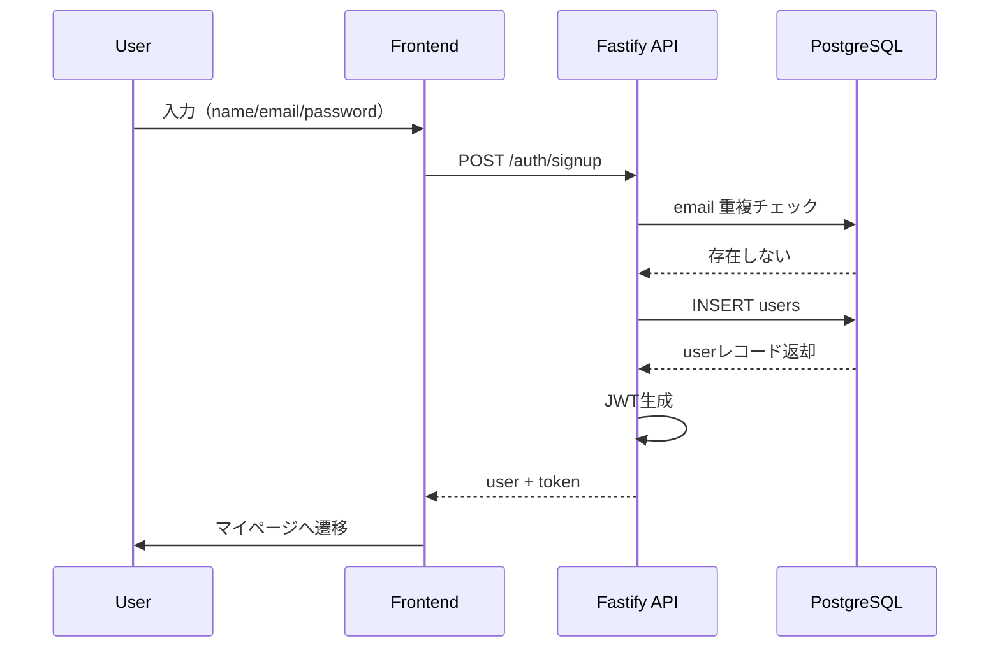

# AUTH-01 新規登録

**POST /auth/signup**

---

# 1. API 概要

| 項目           | 内容                                                 |
| -------------- | ---------------------------------------------------- |
| API ID         | AUTH-01                                              |
| メソッド       | POST                                                 |
| エンドポイント | `/auth/signup`                                       |
| 認証           | 不要（public）                                       |
| 主な目的       | ユーザーアカウントを作成し、JWT セッションを発行する |
| 返却           | user 情報 + JWT（または session token）              |

---

# 2. 主な仕様

### ● 入力：

- 名前
- メールアドレス
- パスワード

### ● 処理内容：

1. 入力バリデーション
2. email 重複確認
3. パスワードをハッシュ化
4. users テーブルに insert
5. 新しい JWT を生成して返す
6. 初期プロフィール（intro、avatarUrl、role など）を設定

### ● 出力：

- user オブジェクト
- token（JWT など）

---

# 3. Request Body 仕様

```json
{
  "name": "たろう",
  "email": "taro@example.com",
  "password": "examplepass"
}
```

### 入力要件（バリデーション）

| フィールド | 型     | 必須 | 制約                           |
| ---------- | ------ | ---- | ------------------------------ |
| name       | string | ○    | 1〜32 文字、前後空白除去       |
| email      | string | ○    | email 形式、lowercase に正規化 |
| password   | string | ○    | 8〜64 文字、英数字記号可       |

### バリデーション例（エラー時）

```
400 Bad Request
{
  "error": "INVALID_NAME",
  "message": "名前を正しく入力してください。"
}
```

---

# 4. 処理フロー（ロジック詳細）

以下は Fastify + TypeScript 前提の処理ですが、他フレームワークでも共通。

---

## STEP 1️⃣：入力チェック

- name / email / password の存在確認
- email 正規表現チェック
- password 長さチェック

---

## STEP 2️⃣：email 重複チェック

SQL：

```sql
SELECT id FROM users WHERE email = $1;
```

存在した場合：

```
409 Conflict
{
  "error": "EMAIL_ALREADY_USED",
  "message": "このメールアドレスはすでに登録されています"
}
```

---

## STEP 3️⃣：パスワードのハッシュ化

推奨：argon2id または bcrypt（bcrypt なら cost=10〜12）

```
hashedPassword = hash(password)
```

---

## STEP 4️⃣：ユーザー作成（DB Insert）

```sql
INSERT INTO users (name, email, password_hash, avatar_url, intro, balance, created_at)
VALUES ($1, $2, $3, $4, $5, 0, NOW())
RETURNING id, name, email, avatar_url, intro, balance;
```

初期値：

| カラム     | 値              |
| ---------- | --------------- |
| avatar_url | null or default |
| intro      | ""              |
| balance    | 0               |
| role       | user（固定）    |

---

## STEP 5️⃣：JWT / Session Token の生成

JWT payload:

```json
{
  "userId": "uuid",
  "email": "taro@example.com",
  "role": "user",
  "exp": 1700000000
}
```

署名アルゴリズム例：

```
HS256 / RS256
```

---

## STEP 6️⃣：レスポンスを返す

成功時：

```
201 Created
```

---

# 5. Response Body（成功例）

```json
{
  "user": {
    "id": "uuid-user-123",
    "name": "たろう",
    "email": "taro@example.com",
    "avatarUrl": null,
    "intro": "",
    "balance": 0
  },
  "token": "jwt-token-string"
}
```

※ token は Authorization ヘッダに設定する設計も可能。

---

# 6. エラーレスポンス一覧（完全版）

| 状況           | ステータス | error              | message                                    |
| -------------- | ---------- | ------------------ | ------------------------------------------ |
| name 不正      | 400        | INVALID_NAME       | 名前を正しく入力してください               |
| email 形式不正 | 400        | INVALID_EMAIL      | 正しいメールアドレスを入力してください     |
| password 不正  | 400        | INVALID_PASSWORD   | パスワードは 8〜64 文字で入力してください  |
| email 重複     | 409        | EMAIL_ALREADY_USED | このメールアドレスはすでに登録されています |
| DB 障害        | 500        | DB_ERROR           | サーバーエラーが発生しました               |
| JWT 生成失敗   | 500        | TOKEN_ERROR        | トークン生成に失敗しました                 |

---

# 7. API シーケンス図（Signup → Login 状態）



---

# 8. Fastify + TypeScript 擬似実装例（参考）

```tsx
app.post("/auth/signup", async (req, reply) => {
  const { name, email, password } = req.body;

  // Validation
  if (!name || name.trim().length < 1)
    return reply
      .code(400)
      .send({ error: "INVALID_NAME", message: "名前を正しく入力してください" });

  if (!isValidEmail(email))
    return reply.code(400).send({
      error: "INVALID_EMAIL",
      message: "正しいメールアドレスを入力してください",
    });

  if (!password || password.length < 8)
    return reply.code(400).send({
      error: "INVALID_PASSWORD",
      message: "パスワードは8文字以上です",
    });

  // Duplicate check
  const exists = await db.query(`SELECT id FROM users WHERE email = $1`, [
    email,
  ]);
  if (exists.rowCount > 0)
    return reply.code(409).send({
      error: "EMAIL_ALREADY_USED",
      message: "このメールは既に使われています",
    });

  // Hash
  const hash = await argon2.hash(password);

  // Insert user
  const user = await db.query(
    `INSERT INTO users (name, email, password_hash, balance)
     VALUES ($1, $2, $3, 0)
     RETURNING id, name, email, intro, avatar_url, balance`,
    [name, email, hash],
  );

  // JWT
  const token = app.jwt.sign({ userId: user.rows[0].id });

  return reply.code(201).send({
    user: user.rows[0],
    token,
  });
});
```

---

# 9. セキュリティ要件

- パスワードは **絶対に生のまま保存しない**
- 強度：argon2id / bcrypt（cost 10〜12）
- email の一意制約（UNIQUE）
- レートリミットを設ける
  → Signup に対しては bot 対策として重要
- JWT の期限（例：24 時間）

---

# 10. この API が担う役割

- ユーザーの最初のエントリーポイント
- セキュリティとデータ品質を担保する領域
- マイページ・通話・ウォレットなど全機能の「入口」
- ログイン後の WebSocket 接続にも連動
