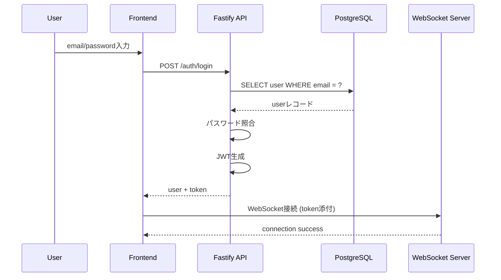

# AUTH-02 ログイン

**POST /auth/login**

---

# 1. API 概要

| 項目           | 内容                            |
| -------------- | ------------------------------- |
| API ID         | AUTH-02                         |
| メソッド       | POST                            |
| エンドポイント | `/auth/login`                   |
| 認証           | 不要（public）                  |
| 主な目的       | 登録済ユーザーの認証と JWT 発行 |
| 出力           | user 情報 + token               |

---

# 2. Request Body

```json
{
  "email": "taro@example.com",
  "password": "examplepass"
}
```

### 入力要件（バリデーション）

| フィールド | 必須 | 制約       |
| ---------- | ---- | ---------- |
| email      | ○    | email 形式 |
| password   | ○    | 8〜64 文字 |

### バリデーションエラー例

```
400 Bad Request
{
  "error": "INVALID_EMAIL",
  "message": "正しいメールアドレスを入力してください。"
}
```

---

# 3. 処理フロー（詳細ロジック）

---

## STEP 1️⃣：メールアドレスとパスワードの存在確認

- email 空 → INVALID_EMAIL
- password 空 → INVALID_PASSWORD

---

## STEP 2️⃣：ユーザー存在チェック

```sql
SELECT * FROM users WHERE email = $1;
```

存在しない場合：

```
401 Unauthorized
{
  "error": "INVALID_CREDENTIALS",
  "message": "メールアドレスまたはパスワードが正しくありません"
}
```

※ セキュリティのため「存在しません」とは言わず **認証失敗に統一**

---

## STEP 3️⃣：パスワード照合（argon2 / bcrypt）

```
if not verify(password, user.password_hash):
    reject 401
```

エラー例：

```
401 Unauthorized
{
  "error": "INVALID_CREDENTIALS",
  "message": "メールアドレスまたはパスワードが正しくありません"
}
```

---

## STEP 4️⃣：アカウント状態チェック（任意）

本番向けの設計として以下をチェック可能：

| 状態             | 説明         | 対応           |
| ---------------- | ------------ | -------------- |
| suspended        | 停止中       | 403 Forbidden  |
| deleted          | 退会済み     | 410 Gone       |
| email_unverified | メール未認証 | 403 + 認証案内 |

---

## STEP 5️⃣：JWT 生成

payload 例：

```json
{
  "userId": "uuid-user-1",
  "email": "taro@example.com",
  "role": "user",
  "exp": 1706600000
}
```

デフォルト有効期限：24 時間（推奨）

---

## STEP 6️⃣：レスポンスを返す

ユーザー情報を返しつつ、フロント側は token を保存。

---

# 4. Response Body（成功例）

```json
{
  "user": {
    "id": "uuid-user-1",
    "name": "たろう",
    "email": "taro@example.com",
    "avatarUrl": "/avatars/user1.jpg",
    "intro": "よろしくお願いします！",
    "balance": 340
  },
  "token": "jwt-token-string"
}
```

---

# 5. エラーレスポンス一覧（AUTH-02）

| 状況                 | ステータス | error               | message                                      |
| -------------------- | ---------- | ------------------- | -------------------------------------------- |
| email 不正           | 400        | INVALID_EMAIL       | 正しいメールアドレスを入力                   |
| password 不正        | 400        | INVALID_PASSWORD    | パスワードを入力してください                 |
| 認証失敗             | 401        | INVALID_CREDENTIALS | メールアドレスまたはパスワードが誤っています |
| アカウント停止       | 403        | ACCOUNT_SUSPENDED   | このアカウントは利用できません               |
| メール未認証（任意） | 403        | EMAIL_NOT_VERIFIED  | メール認証が必要です                         |
| 退会済               | 410        | ACCOUNT_DELETED     | このアカウントは削除済みです                 |
| DB 障害              | 500        | DB_ERROR            | サーバー内部でエラーが発生しました           |
| JWT 生成失敗         | 500        | TOKEN_ERROR         | トークンの生成に失敗しました                 |

---

# 6. セキュリティ設計（重要）

### ■ ブルートフォース攻撃対策

1. **レートリミット**
   - email/IP ごとに 1min あたり max 5 回
2. **アカウントロック（任意）**
   - 連続 5 回失敗 → 5 分ロック
   - ロック中は：
     ```
     403 ACCOUNT_LOCKED
     ```

---

### ■ パスワードは比較・送信時も平文保持しない

- HTTPS 必須
- フロントでは記憶させない

---

### ■ JWT の推奨構成

| 項目          | 設定例                   |
| ------------- | ------------------------ |
| アルゴリズム  | HS256 or RS256           |
| exp           | 24h                      |
| refresh token | 任意（セキュリティ強化） |

---

# 7. シーケンス図（ログイン → WebSocket 接続）



---

# 8. Fastify + TypeScript 擬似コード例

```tsx
app.post("/auth/login", async (req, reply) => {
  const { email, password } = req.body;

  if (!isValidEmail(email))
    return reply.code(400).send({
      error: "INVALID_EMAIL",
      message: "正しいメールアドレスを入力してください",
    });

  if (!password)
    return reply.code(400).send({
      error: "INVALID_PASSWORD",
      message: "パスワードを入力してください",
    });

  const result = await db.query("SELECT * FROM users WHERE email = $1", [
    email,
  ]);
  const user = result.rows[0];

  if (!user)
    return reply.code(401).send({
      error: "INVALID_CREDENTIALS",
      message: "メールアドレスまたはパスワードが誤っています",
    });

  const ok = await argon2.verify(user.password_hash, password);
  if (!ok)
    return reply.code(401).send({
      error: "INVALID_CREDENTIALS",
      message: "メールアドレスまたはパスワードが誤っています",
    });

  const token = app.jwt.sign({ userId: user.id, email: user.email });

  return reply.code(200).send({
    user: {
      id: user.id,
      name: user.name,
      email: user.email,
      avatarUrl: user.avatar_url,
      intro: user.intro,
      balance: user.balance,
    },
    token,
  });
});
```

---

# 9. この API が担う役割

- セッション開始の「入口」
- 通話・ウォレット・履歴・WebSocket すべての前提
- セキュリティ = 信頼性に直結
- 失敗時の UI/UX（丁寧なエラーメッセージ）が重要
