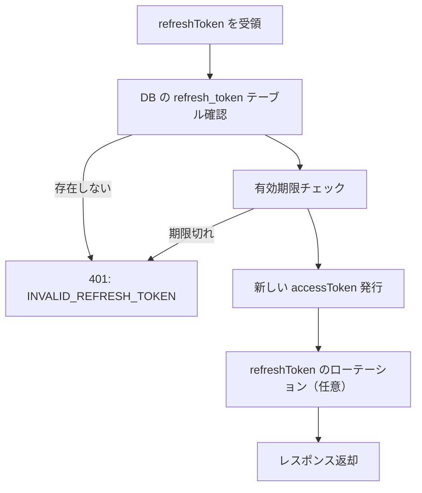

# AUTH-04 JWT リフレッシュ（POST /auth/refresh）

この API は、アクセストークン（短命）を安全に更新し、ユーザーを自動ログアウトさせないための **任意機能（MVP ではなくてもよい）** です。

ただし「おともはん」のように **WebSocket + 長時間通話** が想定されるサービスではアクセストークンの期限切れによる不整合を避けるためにある程度必要性が高い API です。

---

# AUTH-04 JWT リフレッシュ（POST /auth/refresh）

---

# 1. API 概要

| 項目 | 内容 |
| --- | --- |
| API ID | **AUTH-04** |
| メソッド | POST |
| エンドポイント | `/auth/refresh` |
| 認証 | Refresh Token 必須 |
| 目的 | 有効な Refresh Token をもとに新しい Access Token（JWT）を発行する |
| 重要度 | 任意だが、安定運用には推奨 |

---

# 2. 前提のトークン構成（推奨方式）

アクセストークン（JWT）

- 有効期限：**15〜30分**
- WebSocket・REST の認証に使用
- クライアントに保存（localStorage / secure storage）

リフレッシュトークン

- 有効期限：**7〜30日**
- 使い捨て（ローテーション方式）推奨
- HttpOnly Cookie に保存（推奨）

---

# 3. リクエスト形式

### Request（Cookie に refreshToken を保持する場合）

```
POST /auth/refresh
Cookie: refreshToken=xxxxx
```

body 不要。

---

### Request（body 送信方式も可）

```json
{
  "refreshToken": "xxxxx"
}
```

---

# 4. 成功レスポンス

```json
{
  "status": "success",
  "accessToken": "newAccessTokenJWT",
  "expiresIn": 1800
}
```

---

# 5. サーバ処理フロー（重要）



---

# 6. DB テーブル例（refresh_tokens）

| カラム | 型 | 説明 |
| --- | --- | --- |
| user_id | uuid | FK |
| token | text | リフレッシュトークン |
| expires_at | timestamp | 有効期限 |
| created_at | timestamp | 発行日時 |

---

## SQL：トークン確認

```sql
SELECT * FROM refresh_tokens
WHERE token = $1;
```

---

## SQL：ローテーション方式（推奨）

```sql
UPDATE refresh_tokens
SET token = $newToken, expires_at = $newExpires
WHERE user_id = $userId;
```

---

# 7. Fastify + TypeScript 擬似実装

```tsx
app.post('/auth/refresh', async (req, reply) => {
  const refreshToken = req.cookies.refreshToken || req.body.refreshToken;

  if (!refreshToken) {
    return reply.code(401).send({
      status: "error",
      error: "INVALID_REFRESH_TOKEN"
    });
  }

  const row = await db.query(
    'SELECT user_id, expires_at FROM refresh_tokens WHERE token=$1',
    [refreshToken]
  );

  if (row.rowCount === 0 || row.rows[0].expires_at < new Date()) {
    return reply.code(401).send({
      status: "error",
      error: "INVALID_REFRESH_TOKEN"
    });
  }

  const userId = row.rows[0].user_id;

  const newAccessToken = jwt.sign(
    { userId },
    process.env.JWT_SECRET,
    { expiresIn: "30m" }
  );

  // ローテーション（任意）
  const newRefreshToken = uuidv4();
  await db.query(
    'UPDATE refresh_tokens SET token=$1, expires_at=NOW() + INTERVAL \'30 days\' WHERE user_id=$2',
    [newRefreshToken, userId]
  );

  reply
    .setCookie("refreshToken", newRefreshToken, {
      httpOnly: true,
      secure: true,
      sameSite: "lax",
    })
    .send({
      status: "success",
      accessToken: newAccessToken,
      expiresIn: 1800
    });
});
```

---

# 8. WebSocket との関係（重要）

### アクセストークンが失効しても WebSocket は即切断しない

- すでに建立された ws は認証済み
- ただし **再接続時に token が必要**になるため
- 通話終了後や再接続時のために refresh が必要になるケースがある

---

# 9. エラーレスポンス

| 状況 | ステータス | error |
| --- | --- | --- |
| refreshToken 無効 | 401 | INVALID_REFRESH_TOKEN |
| refreshToken 期限切れ | 401 | INVALID_REFRESH_TOKEN |
| DB エラー | 500 | DB_ERROR |

---

# 10. この API の重要性（まとめ）

AUTH-04 refresh は「任意」ですが、導入すると：

- JWT の短命化によるセキュリティ向上
- ユーザーが長期ログインを維持可能
- WebSocket 再接続時の「token 期限切れによる強制ログアウト」を防ぐ
- おともはん（Otomo）が長時間待機している場合の安定化

など複数の UX 改善効果があります。

リアルタイム通話サービスとしては **実装を強く推奨** できます。