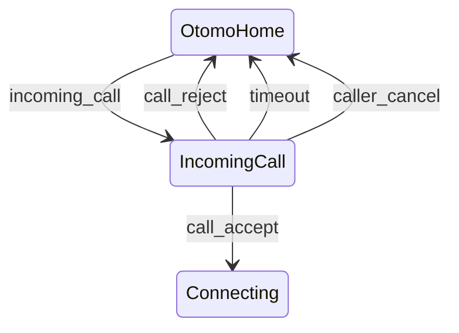

# O-02 着信画面

ユーザー（User）からの通話リクエストを受けて「応答 or 拒否」を判断する中心 UI。

WebSocket のリアルタイムイベントによって表示される画面で、おともはん体験の品質に直結するため、UI・インタラクション・状態遷移を慎重に設計します。

---

# 1. 画面概要

| 項目                    | 内容                                                   |
| ----------------------- | ------------------------------------------------------ |
| 画面 ID                 | O-02                                                   |
| 画面名                  | 着信画面                                               |
| 対象ロール              | Otomo（おともはん）                                    |
| 主な目的                | ・ユーザーからの通話リクエストを受け取る               |
| ・応答 / 拒否を選択する |
| 遷移元                  | O-01 おともはん待機画面                                |
| 遷移先                  | ・通話接続準備 → O-03（おともはん通話中）・拒否 → O-01 |

---

# 2. 表示起点

この画面は WebSocket イベントによって **即時表示** されます。

### イベント例

```json
{
  "type": "incoming_call",
  "callId": "xxxx-xxxx",
  "fromUserId": "user-uuid",
  "fromUserName": "たろう",
  "fromUserAvatar": "/avatars/u1.jpg"
}
```

これを受け取った瞬間に O-02 へ遷移。

---

# 3. UI 構造（ワイヤーフレーム文章化）

```
-----------------------------------------------------------
  < 背景：目立つ通知（暗転 + モーダル中央表示） >

  ＜ユーザーのアイコン画像（大）＞
  たろう さんから着信中…

  「プロフィールを見る」リンク（任意）

  [ 応答する（緑の大ボタン） ]
  [ 拒否する（赤のボタン） ]

  通話開始には 100pt/分 がユーザーに消費されます
  ※おともはんは課金されません

  タイムアウト：30秒
-----------------------------------------------------------
```

---

# 4. UI コンポーネント一覧

| ID  | コンポーネント           | 説明                                 |
| --- | ------------------------ | ------------------------------------ |
| H01 | ユーザー画像             | 丸アイコン大                         |
| H02 | 名前表示                 | 例：「たろう さんから着信中…」       |
| L01 | プロフィールリンク       | U-02 の簡易版（表示任意）            |
| B01 | 応答ボタン               | call_accept を送信                   |
| B02 | 拒否ボタン               | call_reject を送信                   |
| T01 | タイムアウト表示（任意） | 例：残り 27 秒                       |
| N01 | 注意書き                 | 「100pt/分がユーザーに消費されます」 |

---

# 5. ボタン動作と WS イベント

---

## ■ B01：応答する

押した瞬間にサーバへ送信：

```json
{
  "type": "call_accept",
  "callId": "xxxx-xxxx"
}
```

サーバ側処理：

- calls.status = accepted
- 両者へ `call_accepted` を送信
- signaling_start → WebRTC シグナリングへ移行

UI 遷移：

→ O-03（接続中画面）へ

---

## ■ B02：拒否する

押すと以下を送信：

```json
{
  "type": "call_reject",
  "callId": "xxxx-xxxx",
  "reason": "busy"
}
```

サーバ側：

- calls.status = failed
- User へ call_rejected を送信
- Otomo は O-01 へ戻る

UI 遷移：

→ O-01（待機画面）

---

# 6. タイムアウト仕様（重要）

着信後 **30 秒応答がない場合、自動で拒否**。

サーバ側から送信するイベント：

```json
{
  "type": "call_rejected",
  "reason": "timeout"
}
```

UI では：

- 自動閉じる
- 「応答がありませんでした」などのメッセージは不要（静かに O-01 に戻る）

---

# 7. ステータス反映（リアルタイム）

着信中はおともはんのサーバ側ステータスは：

```
ringing
```

応答：accepted

拒否：failed

UI では以下のように表示切り替えするだけで OK。

---

# 8. エラー処理

### ■ サーバ側で callId が不正 → error イベントが返る

```json
{
  "type": "error",
  "code": "INVALID_CALL",
  "message": "通話リクエストが見つかりません"
}
```

→ O-01 に自動で戻る。

### ■ 応答が遅れてユーザーがキャンセルした場合

サーバから：

```json
{
  "type": "call_rejected",
  "reason": "caller_cancel"
}
```

→ UI：「ユーザーが通話をキャンセルしました」

→ O-01 へ戻る

---

# 9. 画面遷移図



---

# 10. この画面が担う役割

- ユーザーとの通話導線の「入口」
- 応答率がサービス品質に直結する
- 電話アプリのような即時性が重要

したがって UI は以下の条件を満たすべきです：

- 大きな応答ボタン
- 顔（アイコン）が明確に見える
- 状態が一目でわかる
- 誤操作を防ぐ（拒否も大きく、色区別）

---

# 🔷 さらに詳細化可能な項目

必要であれば次も作れます：

- **O-03（おともはん側の通話中画面）**
  → U-04 と UI はほぼ同じだが、残ポイント表示なしなど違いあり
- **U-03 通話リクエスト確認モーダル（ユーザー側）**
- **O-01 待機画面**（ステータス変更 UI 含む）

---

# 🔷 次にどの画面を設計しますか？

- **U-05 通話終了画面**（課金サマリー）
- **O-03 おともはん通話中画面**
- **U-03 通話リクエスト確認モーダル**

どれを続けますか？
