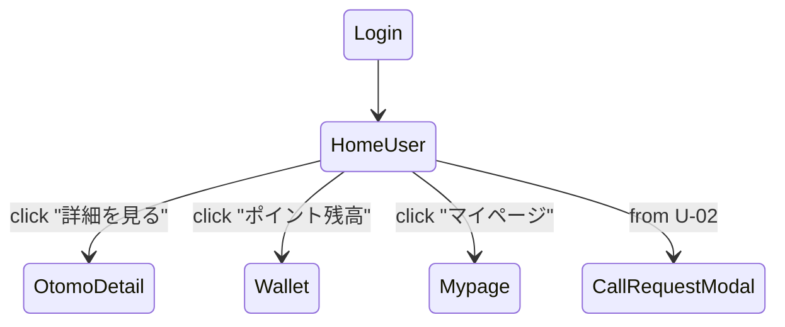

# U-01 ホーム（おともはん一覧）

利用者（User）が最初に見る「トップ画面」。

おともはんのステータス確認・プロフィール閲覧・通話リクエストを行う中心 UI。

---

# 1. 画面概要

| 項目       | 内容                     |
| ---------- | ------------------------ |
| 画面 ID    | U-01                     |
| 画面名     | ホーム（おともはん一覧） |
| 対象ロール | User（利用者）           |
| 主な目的   | ・おともはん一覧を見る   |

・オンライン状態の確認
・U-02 プロフィール画面へ遷移
・通話リクエストを開始する |
| 遷移元 | ・C-01 ログイン
・U-10 マイページ |
| 遷移先 | ・U-02 おともはん詳細
・U-03 通話リクエストモーダル
・U-06 ウォレット
・U-10 マイページ |

---

# 2. 画面 UI 構成（ワイヤーフレーム文章化）

```
-----------------------------------------------------------
  ヘッダー
    [おともはんロゴ]   [ポイント残高表示]   [マイページアイコン]

  セクションタイトル：おともはん一覧

  ▼ おともはんカード（繰り返しリスト）
  ---------------------------------------------------------
  [アイコン画像]  名前：〇〇
  ステータス： ● オンライン / × オフライン / △ 通話中
  自己紹介（20〜30文字の抜粋）
  評価 ★4.7（レビュー数）
  料金：100pt/分
  [詳細を見る（ボタン）]
  ---------------------------------------------------------

  ▼ 下部タブ（オプション）
    [ホーム] [履歴] [ウォレット] [設定]
-----------------------------------------------------------
```

---

# 3. UI コンポーネント一覧

| ID    | コンポーネント   | 種別           | 説明                              |
| ----- | ---------------- | -------------- | --------------------------------- |
| H01   | ロゴ             | 画像/テキスト  | クリックでホームへリフレッシュ    |
| H02   | ポイント残高表示 | Badge          | 現在の所持ポイントを常時表示      |
| H03   | マイページボタン | IconButton     | U-10 へ遷移                       |
| C01   | おともはんカード | Card Component | リスト表示要素                    |
| C01-A | アイコン画像     | Avatar         | プロフィール画像                  |
| C01-B | 名前             | Text           | 最大 16–24 文字                   |
| C01-C | ステータス       | StatusBadge    | online/offline/busy               |
| C01-D | 自己紹介抜粋     | Text           | 省略表示（…）                     |
| C01-E | 評価             | RatingStars    | ★ + 数値 + レビュー数             |
| C01-F | 料金表示         | Text           | 例：100pt/分                      |
| C01-G | 詳細を見るボタン | Button         | U-02 へ                           |
| B01   | 下部フッターナビ | TabBar         | ホーム / 履歴 / ウォレット / 設定 |

---

# 4. 表示データ仕様

### ■ おともはん一覧 → REST API で取得

```
GET /otomo/list
```

### ■ サーバが返すデータ例

```json
[
  {
    "id": "otomo-uuid-1",
    "name": "さくら",
    "avatarUrl": "/avatars/1.jpg",
    "status": "online",        // online | offline | busy
    "rating": 4.7,
    "reviewCount": 128,
    "intro": "今日はたくさん話せるよ！",
    "pricePerMin": 100
  },
  ...
]
```

---

# 5. ステータス仕様

| ステータス   | 表示     | 説明               |
| ------------ | -------- | ------------------ |
| online       | ● 緑     | 発信可             |
| offline      | ○ グレー | 現在待機していない |
| busy         | ● 赤     | 通話中（発信不可） |
| away（任意） | ● 黄     | 一時離席           |

※ busy の場合「詳細を見る」は可能だが「通話開始」不可。

---

# 6. ボタン動作

### ■ 「詳細を見る」 → U-02 へ遷移

おともはんの詳細プロフィール＆通話開始導線を表示。

### ■ ヘッダー右「ポイント残高」 → U-06（ウォレット）

チャージ画面へダイレクト遷移。

### ■ マイページアイコン → U-10

### ■ フッターナビ

- ホーム（U-01）
- 履歴（U-08）
- ウォレット（U-06）
- 設定（C-04）

---

# 7. 画面内の非同期動作（リアクティブな仕様）

### ■ ステータス更新（WS + Polling）

- WebSocket で `otomo_status_update` を受信したら UI を更新
  例：
  ```json
  {
    "type": "otomo_status_update",
    "userId": "otomo-uuid",
    "status": "busy"
  }
  ```
- API polling（30 秒間隔）でも補完可能

### ■ ポイント残高更新（WS）

- 通話中の ticking やチャージ後に表示更新
  ```
  { "type": "wallet_update", "balance": 1800 }
  ```

---

# 8. エラー & 空状態 UX（Empty State）

### ■ おともはんが 0 人のとき：

```
現在利用可能なおともはんがいません。
しばらくしてからもう一度お試しください。
```

### ■ ネットワーク障害：

```
通信エラーが発生しました。
再読み込みする（ボタン）
```

---

# 9. 画面遷移図（簡易）



---

# 10. この画面が担う役割

- サービスの「トップページ」
- ユーザーが「誰と通話できるか」を一瞬で理解できる
- ステータスとプロフィールにより選択しやすい
- 通話開始導線の最重要ポイント

UX 的に **最短 2 クリックで通話開始** が理想です。
