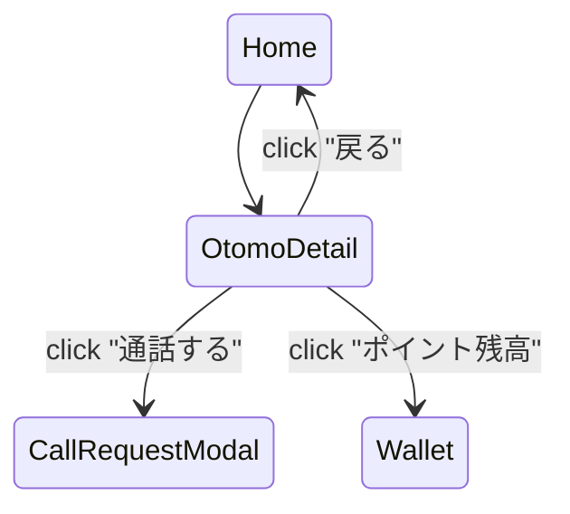

# U-02 おともはん詳細

通話開始直前の意思決定を行う最重要画面。

# 1. 画面概要

| 項目                        | 内容                                            |
| --------------------------- | ----------------------------------------------- |
| 画面 ID                     | U-02                                            |
| 画面名                      | おともはん詳細                                  |
| 対象ロール                  | User（利用者）                                  |
| 主な目的                    | ・おともはんのプロフィール確認                  |
| ・通話を開始する（U-03 へ） |
| 遷移元                      | U-01 ホーム                                     |
| 遷移先                      | U-03 通話リクエスト確認、または U-04 通話中画面 |

---

# 2. 画面構造（ワイヤーフレーム文章化）

```
-----------------------------------------------------------
 < ヘッダー >
  [戻るボタン]        [タイトル：おともはん詳細]        [ポイント残高]

 < おともはん基本情報 >
  [プロフィール画像（大）]
  名前：さくら
  ステータス：● オンライン（または busy / offline）
  評価：★4.8（132件）
  料金：100pt / 分

 < 自己紹介 >
  "はじめまして、さくらです！いつでも話しかけてね"

 < 詳細情報セクション >
  ・話しやすいカテゴリ（例：恋愛 / 雑談 / 仕事の悩み）
  ・稼働時間（例：19:00〜24:00）
  ・趣味 / 得意な話題
  ・レビュー抜粋（最新3件）

 < ボタン >
   [ このおともはんと通話する ]（メインボタン）
      ※ busy の場合：グレーアウト「現在通話中です」

-----------------------------------------------------------
```

---

# 3. UI コンポーネント設計

| ID  | コンポーネント   | 説明                                 |
| --- | ---------------- | ------------------------------------ |
| H01 | 戻るボタン       | U-01 へ戻る                          |
| H02 | タイトル         | 「おともはん詳細」                   |
| H03 | ポイント残高表示 | 現在のポイント（クリックで U-06 へ） |
| P01 | プロフィール画像 | 大きめの丸アイコン（128px〜）        |
| P02 | 名前             | 例：「さくら」                       |
| P03 | ステータス       | ● online / busy / offline            |
| P04 | 評価             | 星 + 数値 + レビュー件数             |
| P05 | 料金表示         | 「100pt / 分」                       |
| S01 | 自己紹介         | 200〜400 文字まで可                  |
| S02 | カテゴリタグ     | チップ状のタグ（複数）               |
| S03 | 稼働時間         | 任意（おともはんが設定している場合） |
| S04 | 趣味 / 得意分野  | テキスト or 小タグ                   |
| R01 | レビュー一覧     | 最新 3 件の簡易レビュー              |
| B01 | 通話開始ボタン   | U-03 へ遷移する重要ボタン            |

---

# 4. 表示データ仕様

### ■ データ取得 API

```
GET /otomo/{id}
```

### ■ Response（例）

```json
{
  "id": "otomo-uuid",
  "name": "さくら",
  "avatarUrl": "/avatars/sakura.jpg",
  "status": "online",
  "rating": 4.8,
  "reviewCount": 132,
  "pricePerMin": 100,
  "intro": "はじめまして、さくらです！いつでも話しましょう 😊",
  "categories": ["恋愛相談", "雑談", "仕事の悩み"],
  "activeHours": "19:00〜24:00",
  "hobbies": ["音楽", "カフェ巡り", "ゲーム"],
  "reviews": [
    {
      "user": "たろう",
      "rating": 5,
      "comment": "とても楽しかった！",
      "date": "2025-02-01"
    },
    {
      "user": "みさき",
      "rating": 4,
      "comment": "優しい雰囲気で安心しました",
      "date": "2025-01-30"
    }
  ]
}
```

---

# 5. ステータス表示仕様

| status  | 表示     | 説明               |
| ------- | -------- | ------------------ |
| online  | ● 緑     | 今すぐ通話可能     |
| busy    | ● 赤     | 通話中（開始不可） |
| offline | ● グレー | 不在               |

### ボタン制御

- **online → [このおともはんと通話する] 有効**
- **busy → ボタンを disabled**
  - 文言：「現在通話中です」
- **offline → disabled**
  - 文言：「現在は不在です」

---

# 6. ボタン挙動（通話開始）

### **B01：通話するボタン**

押すと **U-03 通話リクエスト確認（モーダル）** を表示する。

その際 WebSocket に以下のイベントを送る前提：

```
{
  "type": "call_request",
  "toUserId": "otomo-uuid"
}
```

そして U-03 への遷移。

---

# 7. WebSocket の自動更新

おともはんのステータス（online / busy / offline）はリアルタイム更新されるべき。

例：

```json
{
  "type": "otomo_status_update",
  "userId": "otomo-uuid",
  "status": "busy"
}
```

受け取った瞬間、画面のステータスとボタン状態を更新。

---

# 8. エラー表示（通話開始時）

### 例：残ポイント不足

```
ポイントが不足しています。
チャージしてから通話を開始してください。
```

→ 「チャージ画面へ（U-06）」へのボタンを表示

---

# 9. 画面遷移図



---

# 10. この画面が担う役割

- ユーザーが通話相手を **理解して選ぶための情報提供** を行う
- UI 的には「信頼できる・魅力的に見える」デザインが重要
- 通話開始ボタンの**コンバージョンポイント**として最も重要

この画面の完成度はユーザーの利用率に直結するため、レビューや評価をどの程度強調するかも戦略的です。
