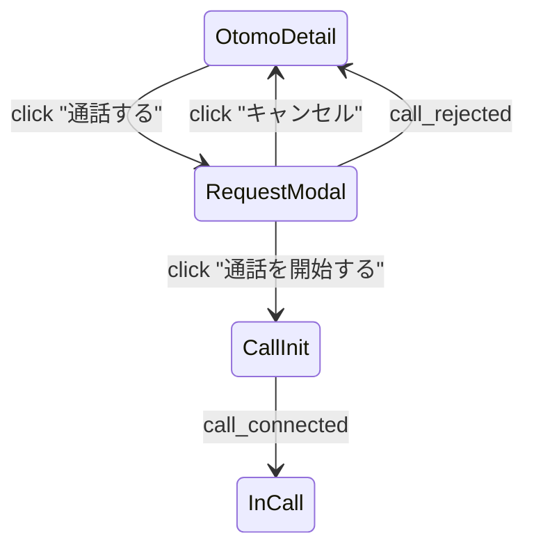

# U-03 通話リクエスト確認モーダル

**ユーザーが通話開始直前に最後の確認を行う場所** であり、ポイント消費・状態遷移・WebSocket 送信などサービスの重要ロジックが関わる要所。

U-02（おともはん詳細） → U-03（確認） → U-04（通話中）という導線の“真ん中”として、UX とエラー処理が特に重要です。

---

# 1. モーダル概要

| 項目 | 内容 |
| --- | --- |
| 画面ID | U-03 |
| 種別 | モーダル（画面遷移なし） |
| 表示対象 | User（利用者） |
| 主な目的 | ・本当に通話を開始するかの確認
・ポイント残高の認識
・WebSocket に call_request を送信 |
| 遷移元 | U-02 おともはん詳細 |
| 遷移先 | U-04 通話中画面（応答後） |

---

# 2. モーダル UI 構造（文章ワイヤーフレーム）

```
-----------------------------------------------------------
  ＜モーダル上部＞
   「通話リクエストを送信しますか？」

  ＜相手情報エリア＞
   [おともはん アイコン（中）]
   さくら さん
   ステータス：● オンライン
   料金：100pt / 分

  ＜ポイント情報＞
   現在のポイント： 340 pt
   1分ごとに100pt消費されます

   ※残ポイントが100pt未満 → 警告表示

  ＜ボタンエリア＞
   [ 通話を開始する（メインボタン） ]
   [ キャンセル ]（閉じる）

  ＜エラー表示（非表示 → 条件で表示）＞
   - 残ポイントが不足しています
   - 通話リクエストが送信できません
-----------------------------------------------------------
```

---

# 3. UI コンポーネント一覧

| ID | 種別 | 内容 |
| --- | --- | --- |
| T01 | タイトル | 「通話リクエストを送信しますか？」 |
| A01 | 相手アイコン | 丸画像 |
| A02 | 相手名 | 表示例：「さくら」 |
| A03 | ステータス表示 | ● online / busy / offline |
| A04 | 料金表示 | 100pt / 分 |
| P01 | 残ポイント表示 | 例：340pt |
| P02 | 注意書き | 「1分ごとに100pt消費されます」 |
| W01 | 警告（残ポイント不足） | 赤字で表示 |
| B01 | 通話を開始する（ボタン） | メインアクション |
| B02 | キャンセル（ボタン） | モーダル閉じる |
| E01 | エラーメッセージ | WS送信失敗など |

---

# 4. モーダル表示ロジック

### ■ U-02 から「通話する」ボタン押下時に表示

状態が online のときのみ表示する。

### ■ おともはんが busy に変わった場合

WS のステータス更新で即閉じてメッセージ表示：

```
このおともはんは現在通話中のため、リクエストを送信できません。
```

---

# 5. ボタン挙動

---

## ■ B01：通話を開始する（最重要）

押した瞬間に WebSocket で以下を送信：

```json
{
  "type": "call_request",
  "toUserId": "otomo-uuid",
  "callId": "自動生成uuid"
}
```

送信後のフロー：

1. モーダルを閉じる
2. “接続準備中” のローディングUIを表示しておく（任意）
3. おともはん側 O-02 「着信画面」へ通知
4. おともはんが応答 → `call_accepted`
    
    → すぐに WebRTC シグナリングへ
    
5. `call_connected` → U-04 通話中画面へ遷移

---

## ■ B02：キャンセル

- モーダル閉じるだけ
- サーバには何も送信しない

---

# 6. ポイント不足時の動作仕様

残ポイントが 100pt 未満のとき：

- メインボタンを **disabled**
- 警告(W01)を表示

表示例：

```
ポイントが不足しています（100pt以上必要）
[ チャージする ] ボタン（U-06 へ遷移）
```

---

# 7. WebSocket で発生し得るエラー対応

通話開始時点で失敗するケースと UI の挙動を定義します。

---

## ケース①：call_rejected（相手が拒否）

```json
{
  "type": "call_rejected",
  "reason": "busy"
}
```

→ モーダル閉じて、UIに toast で表示：

```
相手が通話を拒否しました。
```

---

## ケース②：ユーザーが送信した call_request がタイムアウト

30秒応答なし

UI:

```
応答がありませんでした。
またのご利用をお待ちしています。
```

→ モーダル閉じる

---

## ケース③：ネットワークエラー

call_request が送信できなかった場合：

```
通信エラーが発生しました。もう一度お試しください。
```

---

# 8. 入力チェック・処理要件

| 要件 | 内容 |
| --- | --- |
| 実行の前提 | おともはんが online |
| 通話開始可否 | 残ポイント >= 100 |
| モーダルを閉じた後 | リクエストが進行中であることを UI に表示（任意） |
| コールID | フロント or サーバ生成どちらでもOK（推奨：サーバ生成） |

---

# 9. 画面遷移図



---

# 10. このモーダルの役割

通話開始直前にユーザーが **心理的に納得して proceed する** ための画面。

- ポイントが減ることを明確にする
- 相手の状態を再確認
- キャンセルと開始の選択肢を明確にする
- START ボタンは大きく、押しやすく
- 状態が変わったら自動的にエラーを返して閉じる

この設計は **ユーザー満足度・CS 回避・不正課金回避** の要となる。