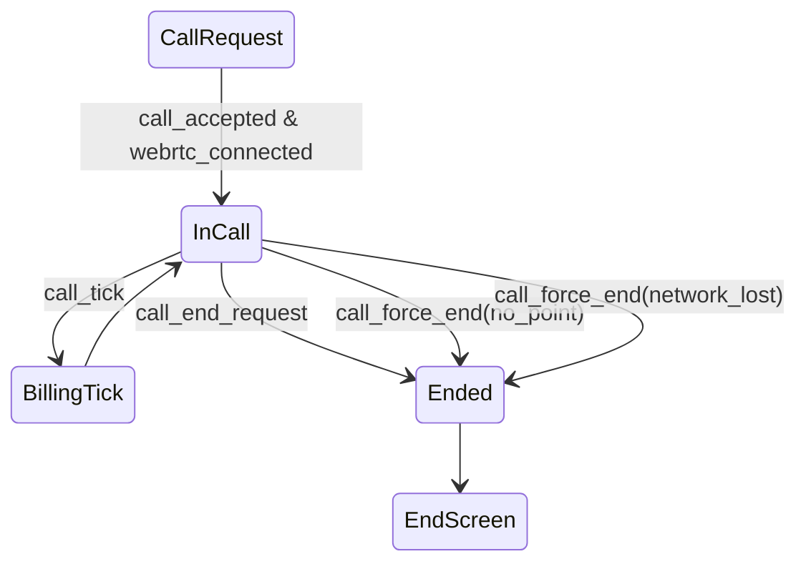

# U-04 通話中画面

この画面は「おともはん」とユーザーが最も長く滞在し、課金ロジック・接続状態・音声操作などが集中する **アプリの中核画面**。

---

# 1. 画面概要

| 項目 | 内容 |
| --- | --- |
| 画面ID | U-04 |
| 画面名 | 通話中画面 |
| 対象ロール | User（利用者） |
| 主な目的 | ・おともはんとの音声通話
・残ポイントの確認
・次の課金（1分ごと）のカウントダウン表示
・通話終了操作 |
| 遷移元 | U-03 通話リクエスト確認 |
| 遷移先 | 通話終了画面（U-05） |

---

# 2. 画面構造（ワイヤーフレーム文章化）

```
-----------------------------------------------------------
  < ヘッダー >
   [← 終了ボタン]          通話中            [残ポイントバッジ]

  < 中央 >
    [おともはんアイコン（大）]
    名前：さくら
    ステータス：通話中（● 赤）

    < 通話タイマー >
      経過時間： 00:03:21

    < 課金カウントダウン >
      次の100pt減算まで： 00:38    ←（直近の tick からのカウント）

  < 下部ボタンエリア >
    [ マイクミュート ON/OFF ]
    [ スピーカー切替 ]
    [ 通話終了（大ボタン） ]

-----------------------------------------------------------
```

ユーザーは **音声のみ** のため画面は極めてシンプル＆見やすく。

---

# 3. UI コンポーネント一覧

| ID | コンポーネント | 説明 |
| --- | --- | --- |
| H01 | 終了ボタン | 通話終了をリクエスト（WS: call_end_request） |
| H02 | タイトル | 「通話中」 |
| H03 | 残ポイント表示 | 例：残 840pt（WSの wallet_update で更新） |
| A01 | おともはん画像 | 丸アイコン（大） |
| A02 | 名前表示 | 例：「さくら」 |
| A03 | 状態表示 | 「通話中」＋●赤 |
| T01 | 通話タイマー | 経過時間（local + server sync） |
| T02 | 次の課金カウントダウン | 1分ごとに減る tick 表示 |
| B01 | ミュートボタン | ローカルの audio track の on/off |
| B02 | スピーカー切替 | スマホの場合：speaker/earpiece |
| B03 | 通話終了ボタン | 終了処理へ（U-05へ） |

---

# 4. 表示データ仕様（サーバ連携）

通話中画面は **WebSocket と密接に連動** します。

### 必須 WS イベント

| イベント | 役割 |
| --- | --- |
| call_state_update | connecting → in_call など状態変化 |
| call_tick | 1分ごとの課金発生（100pt減算） |
| wallet_update | 残ポイント更新 |
| call_force_end | no_point / network_lost など強制終了 |
| call_end | 正常終了通知 |

### API から取得するデータ

通話開始時点で：

```
GET /call/{callId}
```

```json
{
  "callId": "uuid",
  "partner": {
    "name": "さくら",
    "avatarUrl": "...",
  },
  "startedAt": 1700000000,
  "pricePerMin": 100
}
```

---

# 5. タイマー仕様

### ■ （1）経過時間タイマー（T01）

- UI側で1秒ごと更新
- サーバから送られる startedAt を基点に算出
- 例外時（遅延・復帰）にも同期可能

### ■ （2）次の課金までのカウントダウン（T02）

- 課金タイミングは **サーバ authoritative**
- WS イベント `call_tick` により 1分経過が通知される

例：

```json
{
  "type": "call_tick",
  "callId": "uuid",
  "unitIndex": 2,
  "charged": 100,
  "balance": 380,
  "nextBillingAt": 1700003600
}
```

UI では：

```
次の100pt減算まで： 00:59 → 00:00
```

### ■ 課金タイミングは UI ではなくサーバが決定

→ **ユーザーや JS の時計がズレても問題なし**

---

# 6. ボタン動作

### B01：ミュート ON/OFF

- WebRTC の AudioTrack を `enabled = false` にする
- サーバへ送る必要はない（WebRTCローカル操作）

### B02：スピーカー切替（スマホ）

- `setSinkId()`（Safariは不可）を使用
- PCでは非表示または常にスピーカー

### B03：通話終了（重要）

押すと：

```
{
  "type": "call_end_request",
  "callId": "uuid"
}
```

→ サーバが finishing → ended を実行し

→ WS の `call_end` が返る

→ U-05（通話終了画面）に遷移

---

# 7. ローカル例外ハンドリング

### ■ 接続不調（ice connection lost）

UIに小さな警告表示：

```
接続が不安定です…
```

### ■ ネットワーク切断 → `call_force_end` がサーバから飛ぶ

```
{
  "type": "call_force_end",
  "reason": "network_lost"
}
```

→ U-05 へ遷移（終了理由：通信切断）

### ■ ポイント不足

`call_force_end` with reason = "no_point"

```
ポイントが不足したため通話を終了しました。
```

---

# 8. 画面遷移図（通信イベントも含む）



---

# 9. 空状態・異常状態の UI

### ■ connecting 状態

（WebRTC 接続中）

```
接続中… 数秒お待ちください
[スピナー]
```

10秒以上経過したら：

```
接続できませんでした。再度お試しください。
[OK]
```

---

# 10. この画面の役割

U-04 はアプリの「収益の中心」です。

正確な課金 UI・通話品質・例外処理が最も重要になります。

特に：

- 残ポイント表示
- 1分課金のカウントダウン
- 経過時間
- ステータス（通話中）
- ミュート・終了操作

これらが直感的でストレスなく使えるデザインが必要です。