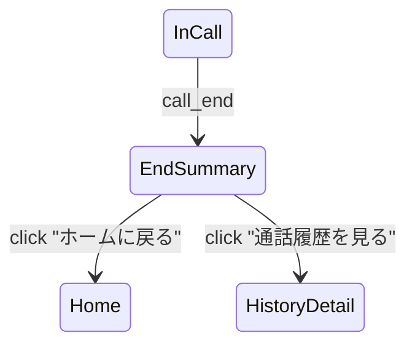

# U-05 通話終了画面

**通話直後の結果表示（課金サマリー）**を行う画面。

ユーザーが安心してサービスを使い続けるためには「何分通話して、いくら消費されたか」が明確である必要がある。

通話終了の理由（user_end / otomo_end / no_point / network_lost など）も示す。

---

# 1. 画面概要

| 項目 | 内容 |
| --- | --- |
| 画面ID | U-05 |
| 画面名 | 通話終了画面（サマリー） |
| 対象ロール | User |
| 主な目的 | ・通話の結果を明確に伝える
・課金ポイントの内訳を見せる
・ウォレット残高を確認させる
・ホームへ戻る or レビューへ誘導 |
| 遷移元 | U-04 通話中画面 |
| 遷移先 | U-01 ホーム
U-08 履歴詳細 |

---

# 2. 表示タイミング

通話中にサーバ側で終了処理が完了すると、WebSocket イベントが送信される。

例：

```json
{
  "type": "call_end",
  "callId": "uuid",
  "reason": "user_end",
  "totalSeconds": 182,
  "totalCharged": 300,
  "unitCount": 3,
  "balance": 720
}
```

このイベントを受けて U-05 を表示する。

---

# 3. UI構造

```
-----------------------------------------------------------
  < ヘッダー >
    （非表示または「通話が終了しました」）

  < 上部エリア >
    [おともはんアイコン（中）]
    さくら さんとの通話が終了しました

    終了理由：ユーザー操作による終了  ←（サーバから取得）

  < 通話情報セクション >
    ・通話時間： 3分02秒
    ・課金ポイント： 300pt（100pt × 3分）
    ・残ポイント：720pt

  < 課金明細（オプション表示） >
    1分目：100pt
    2分目：100pt
    3分目：100pt

  < ボタンエリア >
    [ ホームに戻る ]（U-01）
    [ 通話履歴を見る ]（U-08）
    [ レビューを書く ]（任意）

-----------------------------------------------------------
```

---

# 4. UIコンポーネント一覧

| ID | コンポーネント | 説明 |
| --- | --- | --- |
| H01 | タイトル | 「通話が終了しました」 |
| A01 | おともはんアイコン | 丸画像 |
| A02 | 名前表示 | 「さくら さんとの通話が終了しました」 |
| R01 | 終了理由表示 | user_end / otomo_end / no_point など |
| T01 | 通話時間 | totalSeconds を整形 |
| P01 | 課金ポイント総額 | 例：300pt |
| P02 | 残ポイント | balance |
| D01 | 課金明細 | unitIndex とポイント数 |
| B01 | ホームに戻る | U-01 |
| B02 | 履歴を見る | U-08 |
| B03 | レビューを書く | 任意機能（後述） |

---

# 5. 通話終了理由（終了メッセージ仕様）

サーバ側 `reason` によって表示文が変わる。

| reason | 表示メッセージ |
| --- | --- |
| user_end | あなたが通話を終了しました |
| otomo_end | おともはんが通話を終了しました |
| no_point | ポイント不足により通話が終了しました |
| network_lost | 通信エラーにより通話が終了しました |
| timeout | 通話がタイムアウトしました |
| system_error | システムエラーにより終了しました |

---

# 6. 課金計算表示

### ■ 例：

```
通話時間： 182秒（→ 3分02秒）
課金：100pt × 3分 = 300pt
残ポイント：720pt
```

### ■ 課金明細（call_billing_units）

DB の records を元に表示：

| 分 | 消費ポイント |
| --- | --- |
| 1 | 100 |
| 2 | 100 |
| 3 | 100 |

UI 的には折りたたみ（アコーディオン）でもよい。

---

# 7. 画面遷移（ユーザー動線）



---

# 8. エラー・例外処理

### ■ サマリーデータ取得失敗

API例：

```
GET /calls/{callId}
```

失敗時 UI：

```
通話履歴の取得に失敗しました。
[ホームに戻る]
```

### ■ WebSocket 切断後でも結果は API で復元可能

→ U-05 がうまく表示されずとも、履歴画面（U-08）で表示できる。

---

# 9. レビュー導線（オプション）

サービス改善のため、通話終了後に簡易レビューを促せる。

UI例：

```
さくら さんとの通話はいかがでしたか？
[★評価UI] [あとで]
```

これは必須ではなく、後から追加できる設計にしておく。

---

# 10. この画面の重要性

U-05 は以下の役割を果たす：

- **課金の透明性 → 信頼構築へ直結**
- **残ポイント確認 → 次回利用を促す**
- **履歴・レビュー導線 → 継続利用の促進**
- **エラー内容の明示 → CS トラブル削減**