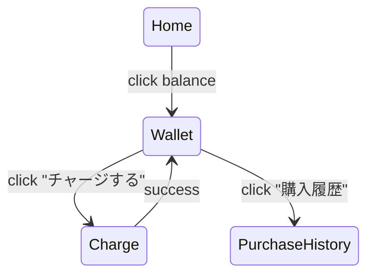

# U-06 ウォレット(ポイント残高)画面

ユーザーが **現在のポイント残高を確認し、チャージ（U-07）へ進む最重要導線** となる画面。シンプルながら「安心・分かりやすい・すぐチャージできる」ことが求められる。

# 1. 画面概要

| 項目 | 内容 |
| --- | --- |
| 画面ID | U-06 |
| 画面名 | ウォレット（ポイント残高） |
| 対象ロール | User |
| 主な目的 | ・所持ポイントの確認
・購入履歴の確認
・ポイントチャージ（U-07）への導線 |
| 遷移元 | U-01 ホーム、U-02 おともはん詳細、U-05 通話終了 |
| 遷移先 | U-07 ポイントチャージ、U-11 購入履歴（任意） |

---

# 2. UI構造（ワイヤーフレーム）

```
-----------------------------------------------------------
<ヘッダー>
  [← 戻る]                ウォレット

<残高カード（大）>
  現在の残高
  720 pt
  （最新更新日時：2025/01/30 21:30）

<アクション>
  [ チャージする（大ボタン） ]
  [ 購入履歴を見る ]（任意）

<過去の使用履歴（任意）>
  - 通話で 300pt 使用（1/30 21:29）
  - 通話で 100pt 使用（1/30 21:28）

<注意書き>
  ポイントは通話時間に応じて消費されます。
-----------------------------------------------------------
```

---

# 3. UIコンポーネント一覧

| ID | 種別 | 内容 |
| --- | --- | --- |
| H01 | 戻るボタン | 前画面へ |
| H02 | タイトル | ウォレット |
| B01 | 大残高カード | 残ポイント表示 |
| B01-A | 残高数値 | 例：720 pt |
| B01-B | 更新日時 | WebSocket で更新される |
| A01 | チャージボタン | U-07 へ遷移 |
| A02 | 購入履歴ボタン | 任意（U-11） |
| L01 | 過去の使用履歴（任意） | 直近数件のポイント使用 |
| N01 | 注意書き | ルール説明 |

---

# 4. 表示データ仕様（API + WS）

---

## ■ 初期ロードデータ（API）

```
GET /wallet/balance
```

Response：

```json
{
  "balance": 720,
  "updatedAt": 1706604600
}
```

---

## ■ リアルタイム更新（WebSocket）

通話中の `call_tick` やチャージ後の `wallet_update` を受信すると更新：

例：

```json
{
  "type": "wallet_update",
  "balance": 580,
  "updatedAt": 1706604700
}
```

UI側は残高カードを自動更新。

---

# 5. チャージ導線（最重要）

チャージボタン：

```
[ チャージする ]
```

押下 → **U-07 ポイントチャージ画面**へ遷移。

UX的には「残高を見たら自然にチャージへ誘導」するシンプルなデザインが良い。

---

# 6. 任意：購入履歴 or 使用履歴

## ■ 購入履歴（推奨）

```
[ 購入履歴を見る ]
```

→ U-11（課金履歴画面）へ遷移可能。

## ■ 使用履歴（通話課金ログ）

U-09 の情報を短縮表示する方式もあり：

例：

```
通話で 300pt 使用（1/30 21:29）
通話で 100pt 使用（1/30 21:28）
```

データ取得 API（任意）：

```
GET /wallet/usage?limit=5
```

---

# 7. エラー処理

### ■ API取得失敗

```
ウォレット情報の取得に失敗しました。
[再読み込み]
```

### ■ 残高が異常な値（マイナスなど）

```
残高が正しく表示できません。
お問い合わせください。
```

※ 実際にはマイナス値を返さない設計にすべき。

---

# 8. 状態遷移図



---

# 9. この画面の役割

U-06 はアプリの中でも特に以下に重要：

### ① 課金透明性の中心

「今いくつ残っているか？」が明確であることは信頼に直結。

### ② チャージ導線の玄関

U-07 へ自然に誘導するための UI 構成が最重要。

### ③ リアルタイム性

通話中にポイントが減っていくため、WS更新への即応が必須。

---

# 10. 実装観点（開発者向けメモ）

- balance はグローバルステート（Vuex or Pinia）で保持すると便利
- U-06 を開いた瞬間に「最新値の API 取得 + WS 値を即反映」する
- 通話終了後 U-05 から U-06 に遷移するケースで差異がないよう統一
- 金額書式は「720 pt」で統一