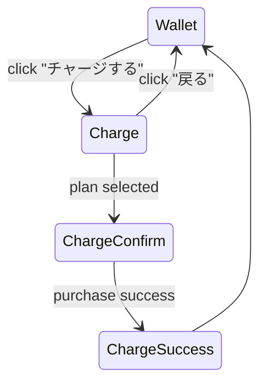

# U-07 ポイントチャージ画面

当画面は、ユーザーが不足ポイントを補充し、通話を継続して利用してもらうための画面**。**

---

# 1. 画面概要

| 項目 | 内容 |
| --- | --- |
| 画面ID | U-07 |
| 画面名 | ポイントチャージ |
| 対象ロール | User |
| 主な目的 | ・ポイントの購入
・購入前に残高と必要ポイントの確認
・決済手段の選択 |
| 遷移元 | U-06 ウォレット
U-03 通話確認の不足案内 |
| 遷移先 | 決済完了画面 → U-06（ウォレット） |

---

# 2. UI構造

```
-----------------------------------------------------------
 <ヘッダー>
  [← 戻る]              ポイントチャージ

 <残ポイント表示>
   現在の残高： 340 pt

 <チャージプラン一覧>
   ▼ プランカード（複数）
   ----------------------------------
   100 pt   ¥120
   （1分通話分）
   [ 選択する ]
   ----------------------------------
   300 pt   ¥360
   [ 選択する ]
   ----------------------------------
   1000 pt  ¥1200
   [ 選択する ]
   ----------------------------------

 <決済方法セクション>
   お支払い方法：
   ・クレジットカード（Visa / Master）
   ・Apple Pay / Google Pay（任意）
   ・PayPay（任意）

 <カード入力フォーム（CC選択時）>
   [カード番号]
   [有効期限]
   [CVC]
   [カード名義人]

 <最終確認>
   購入ポイント：300pt
   支払金額：¥360

 <購入ボタン>
   [ 購入する ]

 <エラー表示エリア>
-----------------------------------------------------------
```

---

# 3. UIコンポーネント一覧

| ID | 種別 | 内容 |
| --- | --- | --- |
| H01 | 戻るボタン | U-06 へ戻る |
| H02 | タイトル | 「ポイントチャージ」 |
| P01 | 残ポイント | 現在の所持ポイント |
| C01 | チャージプランカード | 100pt / 300pt / 1000pt… |
| C01-A | プラン名 | 例）100pt |
| C01-B | 価格 | 例）¥120 |
| C01-C | 選択ボタン | プランを選択 |
| PAY01 | 決済方法セレクタ | CC / PayPay / ApplePay |
| PAY02 | クレカフォーム | カード番号など |
| SUM01 | 最終確認 | プランと支払額の確認 |
| B01 | 購入するボタン | 最終決済実行 |
| E01 | エラー表示欄 | 決済失敗・フォームエラー |

---

# 4. 購入フロー

### ① プラン選択

→ カードが強調され、金額とポイントが SUM01 に反映される。

### ② 決済方法選択

→ クレカならフォームが展開

→ ApplePay / PayPayならフォーム非表示で即進行

### ③ 「購入する」押下

→ API + 決済サービスへリクエスト

→ 成功ならポイント残高更新（WS の wallet_update 受信）

### ④ 完了画面（簡易表示）

→ 「購入が完了しました」

→ U-06 ウォレットへ戻る

---

# 5. API 入出力仕様

### ■ プラン一覧取得

```
GET /wallet/plans
```

Response:

```json
[
  { "id": "plan100", "points": 100, "price": 120 },
  { "id": "plan300", "points": 300, "price": 360 },
  { "id": "plan1000", "points": 1000, "price": 1200 }
]
```

---

### ■ 購入リクエスト

```
POST /wallet/charge
```

Body（例：クレカ）：

```json
{
  "planId": "plan300",
  "paymentMethod": "credit_card",
  "card": {
    "number": "4242424242424242",
    "exp": "12/28",
    "cvc": "123"
  }
}
```

Response（成功）：

```json
{
  "status": "success",
  "chargedPoints": 300,
  "balance": 640
}
```

→ WS 側でも `wallet_update` が通知される。

---

# 6. エラー処理

| エラー | UI表示例 |
| --- | --- |
| CARD_INVALID | カード情報が正しくありません |
| PAYMENT_FAILED | 決済に失敗しました。もう一度お試しください |
| NETWORK_ERROR | 通信エラーが発生しました |
| PLAN_NOT_FOUND | 選択したプランが見つかりません |
| RATE_LIMIT | 決済が短時間に複数回行われました |

エラー時は E01 に赤字表示 + ボタン再活性化。

---

# 7. セキュリティ要件

- カード番号入力欄は **マスク表示**
- 入力フォームには **ブラウザ標準の autocomplete="off"**
- フロントにカード情報を保持しない（Stripe Elements の使用推奨）
- HTTPS 通信必須（本番想定）

---

# 8. モーダル/画面遷移図



---

# 9. 課金導線におけるポイント

- 残高が少ない状態で U-07 に遷移した場合、
    
    「通話には100ptが必要です」という補足も表示
    
- Stripe / PayPayなど実運用を意識した設計
- 「初回限定ボーナスプラン」の追加にも柔軟に対応できる UI

---

# 10. この画面の役割

U-07 は **サービスの収益源であり、離脱率が最も顕著に現れる画面**。

そのため：

- プラン選択は簡単
- 決済方法はわかりやすく
- エラーは丁寧に
- 完了後は「すぐ通話できる」安心感を与える

これが UX の肝となる。