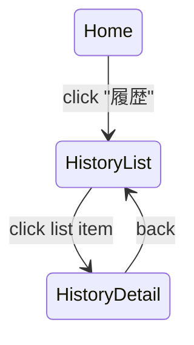

# U-08 通話履歴一覧

当画面は **ユーザーが過去の通話記録や課金履歴を確認するための重要ページ** です。

ポイントの透明性、アプリの信頼性、UX の満足度に直結するため、一覧の仕様・並び順・各行の最適な情報量などを丁寧に設計します。

---

# 1. 画面概要

| 項目       | 内容                         |
| ---------- | ---------------------------- |
| 画面 ID    | U-08                         |
| 画面名     | 通話履歴一覧                 |
| 対象ロール | User                         |
| 主な目的   | ・過去の通話を一覧で確認する |

・通話時間
・消費ポイントの確認
・通話履歴詳細（U-09）への導線 |
| 遷移元 | U-01 ホーム
U-05 通話終了 |
| 遷移先 | U-09 通話履歴詳細 |

---

# 2. UI 構造（ワイヤーフレーム）

```
-----------------------------------------------------------
<ヘッダー>
  [← 戻る]            通話履歴

<フィルター（任意）>
  ・すべて
  ・今月
  ・過去3ヶ月

<通話履歴リスト>
  ▼ 履歴カード（繰り返し表示）
  -------------------------------------------------------
  [おともはんアイコン（小）]
   さくら さん
   2025/01/30  21:22 - 21:29  （通話時間 7分）
   消費ポイント：700pt

   [＞]（詳細へ遷移）
  -------------------------------------------------------

  ▼ 2件目
  …（以下同様）

<空状態>
  「通話履歴はまだありません」

-----------------------------------------------------------
```

---

# 3. UI コンポーネント一覧

| ID    | 種別                   | 内容                        |
| ----- | ---------------------- | --------------------------- |
| H01   | 戻るボタン             | U-01 または前画面へ         |
| H02   | タイトル「通話履歴」   | 中央配置                    |
| F01   | フィルタータブ（任意） | すべて / 今月 / 過去 3 ヶ月 |
| C01   | 履歴カード             | 一件分の通話履歴            |
| C01-A | おともはんアイコン     | 小さめ丸画像                |
| C01-B | 名前                   | 例：さくら                  |
| C01-C | 通話日時               | 例：2025/01/30              |
| C01-D | 通話時間               | 例：7 分                    |
| C01-E | 消費ポイント           | 700pt                       |
| C01-F | 詳細ボタン             | U-09 へ遷移                 |
| E01   | 空状態テキスト         | 通話履歴が無い場合の表示    |

---

# 4. 表示データ仕様

API：

```
GET /calls/history
```

レスポンス例：

```json
[
  {
    "callId": "uuid-001",
    "otomo": {
      "id": "otomo-1",
      "name": "さくら",
      "avatarUrl": "/avatars/1.jpg"
    },
    "startedAt": 1706604120,
    "endedAt": 1706604540,
    "durationSec": 420, // 7分
    "totalCharged": 700
  },
  {
    "callId": "uuid-002",
    "otomo": { ... },
    "durationSec": 180,
    "totalCharged": 300,
    ...
  }
]
```

---

# 5. 各カードの表示ロジック

### ■ 開始時間と終了時間の表示

例：

```
2025/01/30  21:22 - 21:29
```

`durationSec` が 0 の場合は「未接続（キャンセル）」として表示。

---

### ■ 通話時間

秒 → 分に変換：

```
420秒 → 7分
```

59 秒以下の場合は「1 分として課金」なので

「通話時間 1 分」と表示し、課金内容と整合を保つ。

---

### ■ 消費ポイント

```
totalCharged: 700pt
```

---

# 6. 並び順

- デフォルト：**終了日時の降順（最新が上）**
- 過去の履歴を素早く探せる

---

# 7. フィルター（任意仕様）

UX 的に必要であれば追加：

| フィルター          | 条件                         |
| ------------------- | ---------------------------- |
| すべて              | 全件                         |
| 今月                | startedAt が当月のもの       |
| 過去 3 ヶ月         | startedAt >= today - 90 days |
| キャンセル / 未接続 | durationSec == 0             |

フィルターは非必須ですが追加性は高いです。

---

# 8. 空状態 UX

履歴が 0 件のとき：

```
まだ通話履歴がありません
通話をするとここに履歴が表示されます
```

→ CTA（Call To Action）を出しても良い：

```
[ おともはん一覧へ ]（U-01）
```

---

# 9. カードタップ時の遷移

タップ → U-09 通話履歴詳細画面へ

パラメータ：

```
/calls/{callId}
```

---

# 10. エラー処理

### ■ API 取得エラー

```
履歴の取得に失敗しました。
[再読み込み]
```

### ■ レスポンスが空配列 → 空状態表示

---

# 11. 画面遷移図



---

# 12. この画面が担う役割

- ユーザーが通話課金に納得し安心するための「透明性の中心」
- トラブル対応時の証跡としても重要
- 残ポイント不足で終了したなどの情報を確認可能（詳細画面で扱う）

UX としては：

- 見やすい
- シンプル
- 情報量は必要最小限
- 時系列で整理されている
