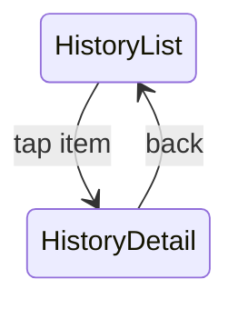

# U-09 通話履歴詳細

ユーザーが**特定の通話がどのように課金され、どれくらいの時間話したかを正確に確認できる画面**。通話課金サービスでは透明性が非常に重要であり、U-05（通話終了画面）よりも**恒久的に履歴を閲覧できる**画面として重要度が高いです。

---

# 1. 画面概要

| 項目 | 内容 |
| --- | --- |
| 画面ID | U-09 |
| 画面名 | 通話履歴詳細 |
| 対象ロール | User |
| 主な目的 | ・通話の詳細、課金内容、終了理由を確認する
・不明点や問い合わせの根拠となる情報を残す |
| 遷移元 | U-08 通話履歴一覧 |
| 遷移先 | U-08 通話履歴一覧（戻る） |

---

# 2. UI構造（ワイヤーフレーム）

```
-----------------------------------------------------------
<ヘッダー>
  [← 戻る]            通話履歴詳細

<上部：おともはん情報>
  [アイコン（中）]   さくら さん
  終了理由：おともはんが通話を終了しました

<通話概要カード>
  通話日：2025/01/30
  時間：21:22 - 21:29
  通話時間：7分02秒
  消費ポイント：700pt

<課金内訳セクション（アコーディオン）>
  ▼ 「課金詳細を表示」
      1分目：100pt（21:23）
      2分目：100pt（21:24）
      3分目：100pt（21:25）
      …
      合計：700pt

<その他情報>
  callId：uuid-001
  終了ステータス：normal

<問い合わせ導線（任意）>
  [この通話について問い合わせる]

-----------------------------------------------------------
```

---

# 3. UIコンポーネント一覧

| ID | 種別 | 内容 |
| --- | --- | --- |
| H01 | 戻るボタン | 一覧（U-08）へ戻る |
| H02 | タイトル | 通話履歴詳細 |
| A01 | おともはんアイコン | 丸画像 |
| A02 | 名前 | 例：さくら |
| R01 | 終了理由 | user_end / otomo_end / no_point / network_lost |
| C01 | 通話概要カード | 日時・時間帯・通話時間・消費ポイント |
| C01-A | 通話日 | yyyy/MM/dd |
| C01-B | 開始・終了時刻 | HH:mm - HH:mm |
| C01-C | 通話時間 | mm分ss秒 |
| C01-D | 消費ポイント | totalCharged |
| D01 | 課金内訳 | billing units の一覧 |
| D01-A | 各課金単位 | 例：1分目＝100pt |
| D01-B | 合計欄 | total |
| M01 | メタ情報 | callId / 終了ステータスなど |
| B01 | 問い合わせボタン | CS導線（任意） |

---

# 4. 表示データ仕様（API）

```
GET /calls/{callId}
```

レスポンス例：

```json
{
  "callId": "uuid-001",
  "otomo": {
    "id": "otomo-1",
    "name": "さくら",
    "avatarUrl": "/avatars/1.jpg"
  },
  "startedAt": 1706604120,
  "endedAt": 1706604542,
  "durationSec": 422,
  "totalCharged": 700,
  "billingUnits": [
    { "unitIndex": 1, "charged": 100, "timestamp": 1706604180 },
    { "unitIndex": 2, "charged": 100, "timestamp": 1706604240 },
    { "unitIndex": 3, "charged": 100, "timestamp": 1706604300 },
    { "unitIndex": 4, "charged": 100, "timestamp": 1706604360 },
    { "unitIndex": 5, "charged": 100, "timestamp": 1706604420 },
    { "unitIndex": 6, "charged": 100, "timestamp": 1706604480 },
    { "unitIndex": 7, "charged": 100, "timestamp": 1706604540 }
  ],
  "endReason": "otomo_end"
}
```

---

# 5. 表示ロジック

---

## ■ 通話日（C01-A）

`startedAt` → yyyy/MM/dd 形式に整形

---

## ■ 通話時間帯（C01-B）

```
21:22 - 21:29
```

（秒は表示しない）

---

## ■ 通話時間（C01-C）

```
422秒 → 7分02秒
```

---

## ■ 消費ポイント（C01-D）

```
totalCharged = billingUnits の合計値
```

---

## ■ 終了理由（R01）

サーバの endReason を以下の文言に変換：

| reason | 表示 |
| --- | --- |
| user_end | あなたが通話を終了しました |
| otomo_end | おともはんが通話を終了しました |
| no_point | 残ポイントが不足したため終了しました |
| network_lost | 通信エラーにより終了しました |
| timeout | 通話がタイムアウトしました |
| system_error | システムエラーにより終了しました |

---

# 6. 課金詳細

折り畳み形式（アコーディオン）推奨。

### 表示例：

```
▼ 課金詳細を表示
  1分目：100pt（21:23）
  2分目：100pt（21:24）
  3分目：100pt（21:25）
  …
  合計：700pt
```

timestamp → HH:mm に整形。

---

# 7. メタ情報（M01）

### 表示例（控えめなグレー文字）：

```
callId：uuid-001
終了ステータス：normal
```

CS（サポート）用にも必須。

---

# 8. エラー処理

### ■ API 取得失敗

```
通話履歴の取得に失敗しました。
[再読み込み]
[一覧に戻る]
```

### ■ callId が不正

```
該当する通話履歴が見つかりませんでした。
```

---

# 9. 画面遷移図



---

# 10. この画面が担う役割

U-09 は **課金サービスの信頼性の根幹** となる画面です。

特に：

- 「いつ」
- 「何分」
- 「いくら消費したか」
- 「なぜ終了したか」

が正確に記録・表示されていることは、ユーザーが安心してサービスを使い続けるために必須です。課金明細（billingUnits）を細かく見せることで、不正疑惑・問い合わせの防止にも大きく貢献します。