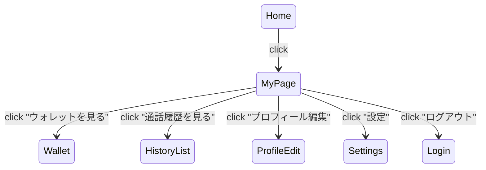

# U-10 マイページ

ユーザーが **自分のアカウント情報を確認・編集し、設定画面やウォレット画面へアクセスするためのプロフィール中枢画面**。

---

# 1. 画面概要

| 項目 | 内容 |
| --- | --- |
| 画面ID | U-10 |
| 画面名 | マイページ |
| 対象 | User |
| 主な目的 | ・プロフィール確認
・編集（U-11）
・ポイント情報（U-06）
・履歴（U-08）
・設定（C-04）
・退会やログアウトの導線 |
| 遷移元 | U-01 ホーム |
| 遷移先 | U-06 ウォレット
U-08 履歴
U-09 履歴詳細
U-11 プロフィール編集
C-04 設定 |

---

# 2. UI構造（ワイヤーフレーム）

```
-----------------------------------------------------------
<ヘッダー>
  [← 戻る]            マイページ

<上部ユーザー情報カード>
  [プロフィール画像（中）]
  ユーザー名：たろう
  メールアドレス：taro@example.com
  [ プロフィールを編集する ]

<ウォレットセクション>
  残ポイント：720 pt
  [ ウォレットを見る ]（U-06）

<通話履歴セクション>
  直近の通話：さくら さん（7分）
  [ 通話履歴を見る ]（U-08）

<アカウント設定セクション>
  [ 設定 ]（C-04）
  [ ログアウト ]
  [ 退会手続き ]（任意）

-----------------------------------------------------------
```

---

# 3. UIコンポーネント一覧

| ID | 種別 | 内容 |
| --- | --- | --- |
| H01 | 戻るボタン | U-01 へ |
| H02 | タイトル | マイページ |
| U01 | プロフィール画像 | 丸画像 |
| U02 | 名前 | 例：たろう |
| U03 | メールアドレス | 例：[taro@example.com](mailto:taro@example.com) |
| B01 | プロフィール編集ボタン | U-11（編集画面）へ遷移 |
| W01 | 残ポイント | balance |
| B02 | ウォレットボタン | U-06 |
| H01 | 直近通話履歴 | 最新1件を表示（任意） |
| B03 | 通話履歴へボタン | U-08 |
| B04 | 設定ボタン | C-04 |
| B05 | ログアウトボタン | セッション破棄 |
| B06 | 退会ボタン | アカウント削除フロー（任意） |

---

# 4. 表示データ仕様

### ■ API：ユーザー情報

```
GET /user/me
```

例：

```json
{
  "id": "user-1",
  "name": "たろう",
  "email": "taro@example.com",
  "avatarUrl": "/avatars/u1.jpg",
  "balance": 720,
  "latestCall": {
    "otomoName": "さくら",
    "durationSec": 420
  }
}
```

---

# 5. プロフィール情報の表示

- 名前（最大32文字）
- メールアドレス
- アイコン（任意で変更可能）

### 編集導線：

```
[ プロフィールを編集する ]
```

→ U-11（プロフィール編集画面へ）

---

# 6. ウォレット（ポイント残高）表示

```
残ポイント：720pt
```

右側に CTA（ボタン）：

```
[ ウォレットを見る > ]
```

→ U-06 へ遷移

※ 残高は WebSocket の `wallet_update` で自動更新される設計が理想。

---

# 7. 通話履歴導線（U-08）

直近1件（任意）の履歴も軽く表示すると UX が良い：

例：

```
直近の通話：さくら さん（7分）
[ 通話履歴を見る > ]
```

データは `/calls/history?limit=1` で取得可能。

---

# 8. アカウント設定セクション

```
[ 設定 ]
```

→ C-04 設定画面へ（通知設定・利用規約など）

```
ログアウト
```

- JWT/Session破棄
- ログイン画面（C-01）へ遷移

```
退会手続き（任意）
```

→ アカウント削除依頼の確認ダイアログ

→ call履歴や課金履歴は保持にするのが一般的

---

# 9. エラー処理

### ■ GET /user/me が失敗した場合

```
ユーザー情報の取得に失敗しました。
[再読み込み]
```

### ■ アバター読み込み失敗

→ 初期アイコンを表示

### ■ ログアウト API 失敗

→ ローカル側だけでセッションクリアして問題なし

---

# 10. 状態遷移図



---

# 11. この画面の役割

U-10 はユーザーにとって「自分のアカウントの中心」です。

- ポイント残高が一目でわかる
- 履歴・設定への導線がまとまっている
- アカウント管理がしやすい
- プロフィール編集の入口になる

サービス利用の満足度を上下する重要な UI です。