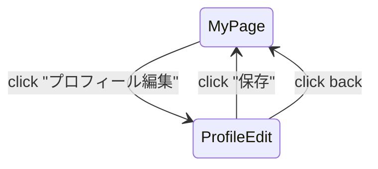

# U-11 プロフィール編集画面

了解です。

ここでは **U-11「プロフィール編集画面」** の詳細設計書を作成します。

U-11 はユーザーが **名前・アイコン・自己紹介などの個人情報を編集するための画面** であり、

ユーザー体験の基本品質に関わる重要な機能です。

U-10（マイページ）と連動し、変更後は U-10 に反映されます。

---

# 1. 画面概要

| 項目 | 内容 |
| --- | --- |
| 画面ID | U-11 |
| 画面名 | プロフィール編集 |
| 対象 | User |
| 主な目的 | ・ユーザー情報（名前・アイコン・自己紹介）の編集
・保存→U-10（マイページ）へ反映 |
| 遷移元 | U-10 マイページ |
| 遷移先 | U-10 マイページ |

---

# 2. UI構造（ワイヤーフレーム）

```
-----------------------------------------------------------
<ヘッダー>
  [← 戻る]                  プロフィール編集
  [ 保存 ]（右上）

<アイコン編集エリア>
  [プロフィール画像（大）]
  [ 画像を変更する ] ボタン

<フォームエリア>
  （ラベル）名前
  [ 名前入力フィールド ]

  （ラベル）メールアドレス（変更不可）
  [ email@example.com ]（グレーアウト）

  （ラベル）自己紹介（任意）
  [ テキストエリア（最大300文字） ]

<アカウント情報エリア（任意）>
  [ パスワードを変更する ]（別画面）

<エラーメッセージ領域>

-----------------------------------------------------------
```

---

# 3. UIコンポーネント一覧

| ID | 種別 | 内容 |
| --- | --- | --- |
| H01 | 戻るボタン | U-10 へ戻る |
| H02 | 保存ボタン | プロフィール更新APIを叩く |
| A01 | プロフィール画像 | 丸型（タップで変更） |
| A02 | アイコン変更ボタン | ファイル選択 or カメラ |
| F01 | 名前入力 | 必須、1〜32文字 |
| F02 | メールアドレス表示 | 編集不可 |
| F03 | 自己紹介 | 任意、最大300文字 |
| S01 | パスワード変更導線（任意） | セキュリティ設定へ |
| E01 | エラー表示 | 入力エラー・APIエラー |

---

# 4. 編集可能項目と制限

---

## ■ 名前（必須）

- 1〜32文字
- 絵文字・記号可
- 前後の空白削除

入力チェック：

- 未入力 → エラー
    
    ```
    名前を入力してください。
    ```
    

---

## ■ プロフィール画像（任意）

- JPG / PNG / WEBP
- 最大 5MB
- 円形トリミング

選択後、プレビュー表示してから保存。

アップロードロジック：

```
PUT /user/avatar
multipart/form-data
```

成功後に返される avatarUrl を保存。

---

## ■ メールアドレス（表示のみ）

理由：

プロフィール編集画面では変更不可とすることで UX を簡潔に保つ。

（メール変更機能が必要なら C-04 設定画面で扱う）

---

## ■ 自己紹介（任意）

- 最大300文字
- 通話前の相手選びに影響しやすい項目

---

# 5. 保存（更新API）

### エンドポイント

```
PUT /user/profile
```

### Request Body

```json
{
  "name": "更新後の名前",
  "intro": "自己紹介テキスト"
}
```

### Response

```json
{
  "status": "success",
  "user": {
    "name": "更新後の名前",
    "avatarUrl": "/avatars/new1.jpg",
    "intro": "..."
  }
}
```

保存成功後 → U-10（マイページ）に戻り、最新情報を表示。

---

# 6. 保存時のエラー例

| 状況 | 表示メッセージ例 |
| --- | --- |
| 名前が空 | 「名前を入力してください」 |
| 画像サイズ超過 | 「画像サイズは5MB以下にしてください」 |
| ネットワークエラー | 「通信エラーが発生しました」 |
| サーバ内部エラー | 「プロフィールを更新できませんでした」 |

エラーは E01 に赤字表示。

---

# 7. UX仕様（重要ポイント）

---

### ■ 保存成功したら即マイページへ戻る

戻る遷移時に toast で通知：

```
プロフィールを更新しました
```

---

### ■ フォームが変更されていない場合 → 保存ボタンを非活性化

```
disabled = !hasChanges
```

---

### ■ 名前入力時のリアルタイムバリデーション

- 空欄でエラー
- 32文字超過で赤枠とカウンター表示

---

### ■ 画像変更時は圧縮（フロント側）

- 画像が大きいとアップロード時間が長く UX 悪化 → 圧縮推奨

---

# 8. 画面遷移図



---

# 9. この画面の役割

U-11 は以下の UX 価値を提供する：

- ユーザーが「自分らしさ」を設定できる
- 通話相手に魅力的に見せる要素
- アイコンと名前の更新が中心的役割
- サービス体験への帰属意識を高める画面

特に画像変更は “個人の存在感” を決定し、サービス継続率に影響する。