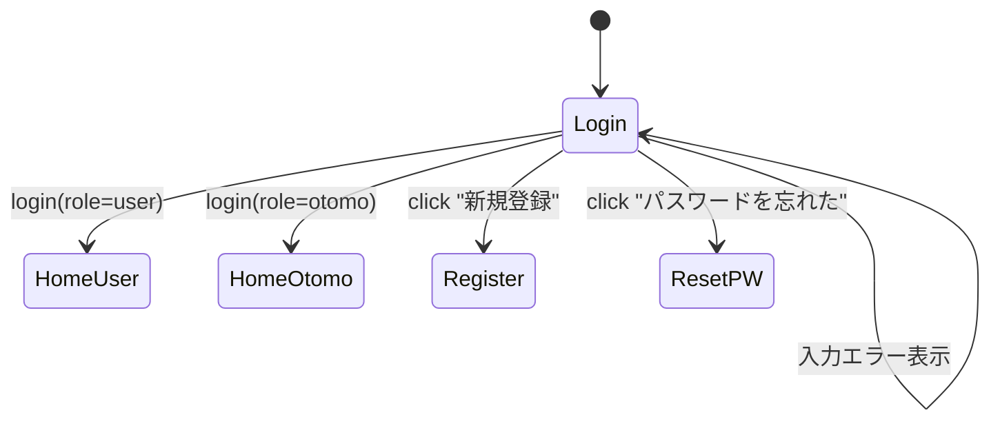

# C-01 ログイン画面

「C-01 ログイン画面」の **画面設計書（UI項目・動作・API／バリデーション・遷移）** を詳細にまとめる。

## **目的**

ユーザー（利用者 / おともはん共通）がアカウントへログインする。

Fastify REST API（あるいは Supabase Auth）と連携する想定。

---

# 1. 画面概要

| 項目       | 内容                            |
| ---------- | ------------------------------- |
| 画面ID     | C-01                            |
| 画面名     | ログイン画面                    |
| 対象ロール | User / Otomo 共通               |
| 主な機能   | ・メール + パスワードでログイン |

・エラー表示
・パスワード再発行導線
・新規登録導線 |
| 遷移元 | 共通：ログアウト後 / 未ログインアクセス時 |
| 遷移先 | User：ホーム(U-01)、Otomo：待機画面(O-01) |

---

# 2. UIレイアウト構造（情報設計）

```
---------------------------------------
  ロゴ（サービス名：おともはん）

  （ラベル）メールアドレス
  [ テキスト入力 email ]

  （ラベル）パスワード
  [ パスワード入力 password ]

  [ ログインボタン ]

  （区切り線 または "または"）

  [ 新規登録はこちら ]   ← C-02 へ

  [ パスワードをお忘れですか？ ] ← リセットフローへ

  （エラー表示エリア）
---------------------------------------

```

# 3. 画面要素（UIコンポーネント一覧）

| ID  | コンポーネント         | 種別                | 必須 | 説明                             |
| --- | ---------------------- | ------------------- | ---- | -------------------------------- |
| L01 | サービスロゴ           | 画像/テキスト       | -    | おともはんロゴ                   |
| I01 | メールアドレス入力     | TextField(email)    | ✔    | メール形式チェック               |
| I02 | パスワード入力         | TextField(password) | ✔    | パスワード非表示切替アイコンあり |
| B01 | ログインボタン         | ボタン              | ✔    | バリデーションOKで活性化         |
| L02 | 新規登録リンク         | TextLink            | -    | C-02 へ遷移                      |
| L03 | パスワードリセット     | TextLink            | -    | PWリセット画面へ                 |
| E01 | エラーメッセージ表示欄 | Text                | -    | API失敗時に表示                  |

# 4. 入力バリデーション仕様

### ■ メール

- 必須
- email正規表現
- 前後の空白トリム

### ■ パスワード

- 必須
- 8〜64文字（仮）
- 半角英数字・記号許容

### ■ フォーム全体

- メールとパスワードが有効なら B01（ログインボタン）を活性化

---

# 5. API I/O（ログイン処理）

ログイン画面ではこの API を呼び出す想定：

### ■ エンドポイント（例）

```
POST /auth/login
```

### ■ Request Body

```json
{
  "email": "user@example.com",
  "password": "********"
}
```

### ■ Response（成功例）

```json
{
  "token": "jwt-token-or-session-id",
  "user": {
    "id": "uuid",
    "role": "user",
    "name": "たろう",
    "avatar_url": "..."
  }
}
```

### ■ Response（失敗）

```json
{
  "error": "INVALID_CREDENTIALS",
  "message": "メールアドレスまたはパスワードが違います。"
}
```

**UIに表示するのは message のみ。**

# 6. ログイン後の遷移仕様

### ■ role = "user"

→ **U-01 ホーム（おともはん一覧）**へ遷移。

### ■ role = "otomo"

→ **O-01 おともはんホーム（待機画面）**へ遷移。

### ■ その他

→ 400 / 401 エラー → エラーメッセージ表示（E01）

---

# 7. エラーメッセージ一覧（UI出し分け）

| エラーコード        | 表示メッセージ                                   |
| ------------------- | ------------------------------------------------ |
| INVALID_CREDENTIALS | メールアドレスまたはパスワードが正しくありません |
| USER_NOT_FOUND      | アカウントが存在しません                         |
| DEACTIVATED         | このアカウントは利用停止されています             |
| NETWORK_ERROR       | ネットワークに問題が発生しました                 |
| SERVER_ERROR        | サーバーで問題が発生しました                     |

---

# 8. 状態遷移（画面レベル）



---

# 9. UI振る舞い（インタラクション）

- メールまたはパスワードが未入力 → ボタン非活性
- 入力中に Enter → ログインボタン押下と同じ動作
- ログイン中（API呼び出し中）：
  - ログインボタンをローディング状態に
  - 二重送信防止
- 成功時：
  - ローカルストレージ/IndexedDB に token 保存
  - Role 判定してリダイレクト
- 失敗時：
  - E01 にエラーメッセージ描画
  - パスワード欄をクリア
