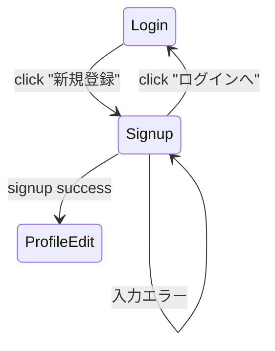

# C-02 会員登録画面

**C-02 会員登録画面（Sign Up Screen）の詳細設計書** を作成します。

C-01 と同じ粒度で、UI・バリデーション・API・遷移など、Figma に落とせるレベルでまとめます。

---

## 1. 画面概要

| 項目       | 内容                                                  |
| ---------- | ----------------------------------------------------- |
| 画面ID     | C-02                                                  |
| 画面名     | 会員登録（サインアップ）                              |
| 対象ロール | User / Otomo 共通（登録後にロールを選択する方式も可） |
| 主な機能   | ・アカウント作成                                      |

・認証メール送信 or 即時ログイン
・入力エラーチェック |
| 遷移元 | ログイン画面（C-01） |
| 遷移先 | 初回プロフィール編集（C-03）または Home(U-01/O-01) |

---

# 2. UI レイアウト（ワイヤーフレーム文章化）

```
---------------------------------------
  ロゴ（おともはん）

  （ラベル）名前
  [ テキスト入力 name ]

  （ラベル）メールアドレス
  [ テキスト入力 email ]

  （ラベル）パスワード
  [ パスワード入力 password ]

  （ラベル）パスワード（確認）
  [ パスワード入力 passwordConfirm ]

  [ 登録する ボタン ]

  「すでにアカウントをお持ちですか？ ログインへ」 (リンク)

  （エラー表示エリア）
---------------------------------------
```


# 3. UI コンポーネント一覧

| ID  | 種別            | 要素名               | 必須 | 説明                       |
| --- | --------------- | -------------------- | ---- | -------------------------- |
| L01 | Label           | 名前                 | ✔    | 1〜32文字                  |
| I01 | Input(text)     | 名前入力欄           | ✔    |                            |
| L02 | Label           | メールアドレス       | ✔    |                            |
| I02 | Input(email)    | メール入力欄         | ✔    |                            |
| L03 | Label           | パスワード           | ✔    |                            |
| I03 | Input(password) | パスワード入力欄     | ✔    | 8文字以上                  |
| L04 | Label           | パスワード確認       | ✔    |                            |
| I04 | Input(password) | パスワード確認欄     | ✔    | I03 と一致必須             |
| B01 | Button          | 登録する             | ✔    | バリデーション成功で活性化 |
| L05 | Link            | ログインへ戻る       | -    | C-01 へ                    |
| E01 | Text            | エラーメッセージ表示 | -    | API失敗・登録不可など      |

---

# 4. バリデーション仕様（UX 観点も含む）

## ■ 名前

- 必須
- 1〜32文字
- 絵文字可・記号可（ユーザー表現自由度のため）

## ■ メール

- 必須
- email形式チェック
- 前後の空白除去

## ■ パスワード

- 必須
- 8〜64文字（セキュリティと利便性のバランス）
- 英数字・記号可
- 同時に「強度表示バー」を付けても良い（任意）

## ■ パスワード確認

- 必須
- パスワードと一致していなければエラー

## ■ ボタン活性化条件

```
name OK &&
email format OK &&
password OK &&
passwordConfirm === password
```

---

# 5. API I/O（アカウント作成）

### ■ エンドポイント案

```
POST /auth/signup
```

### ■ Request Body

```json
{
  "name": "太郎",
  "email": "user@example.com",
  "password": "********"
}
```

### ■ Response（成功）

```json
{
  "user": {
    "id": "uuid",
    "name": "太郎",
    "email": "user@example.com"
  },
  "token": "jwt-or-session-token"
}
```

### ■ Response（失敗）

例：メール重複

```json
{
  "error": "EMAIL_ALREADY_USED",
  "message": "このメールアドレスはすでに登録されています"
}
```

例：弱いパスワード

```json
{
  "error": "WEAK_PASSWORD",
  "message": "パスワードが条件を満たしていません"
}
```

---

# 6. エラー表示仕様（E01）

| エラーコード       | 表示メッセージ                             |
| ------------------ | ------------------------------------------ |
| EMAIL_ALREADY_USED | このメールアドレスはすでに登録されています |
| INVALID_EMAIL      | 正しいメールアドレスを入力してください     |
| WEAK_PASSWORD      | パスワードが条件を満たしていません         |
| PASSWORD_NOT_MATCH | パスワードが一致しません                   |
| SERVER_ERROR       | サーバーで問題が発生しました               |
| NETWORK_ERROR      | ネットワークエラーが発生しました           |

---

# 7. 完了後の遷移仕様

### ■ サインアップ成功直後の判断

1. **即ログイン方式の場合（MVP向け）**

   ```
   → token を保存 → user.role を確認 → 次の画面へ
   ```

2. **メール認証方式の場合（本番向け）**

   ```
   認証メール送信しました → メール確認画面へ遷移
   ```

今回は MVP 寄りの **即ログイン方式** を採用すると簡単です。

### ■ ロールによる遷移

| role  | 遷移先                         |
| ----- | ------------------------------ |
| user  | U-01：ホーム（おともはん一覧） |
| otomo | O-01：おともはん待機画面       |

※ 新規登録時点でロールを持たせず、

初回ログイン後にロール選択画面を出す設計も可能（将来拡張）。

---

# 8. 状態遷移（画面レベル）



---

# 9. インタラクション（UI動作）

- 入力中にリアルタイムでバリデーション
- フォームが valid になった状態で Enter → 登録実行
- 登録API呼び出し中は「登録」ボタンをローディング状態に
- 成功 → トークン保存 → 次画面へリダイレクト
- 失敗 → E01 にエラー表示、パスワード欄クリア

---

# 10. 今後の拡張案

### 必要に応じて追加できる仕様：

- SNSログイン（Google / Apple）
- 電話番号での登録（SMS認証）
- 招待コード方式
- リファラートラッキング
- 未成年フィルター（年齢入力）
- 利用規約同意チェック（必須チェックボックス）
